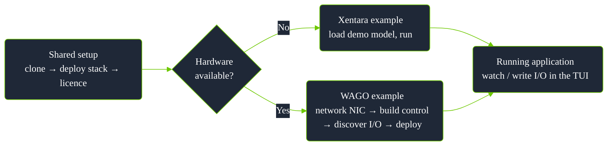
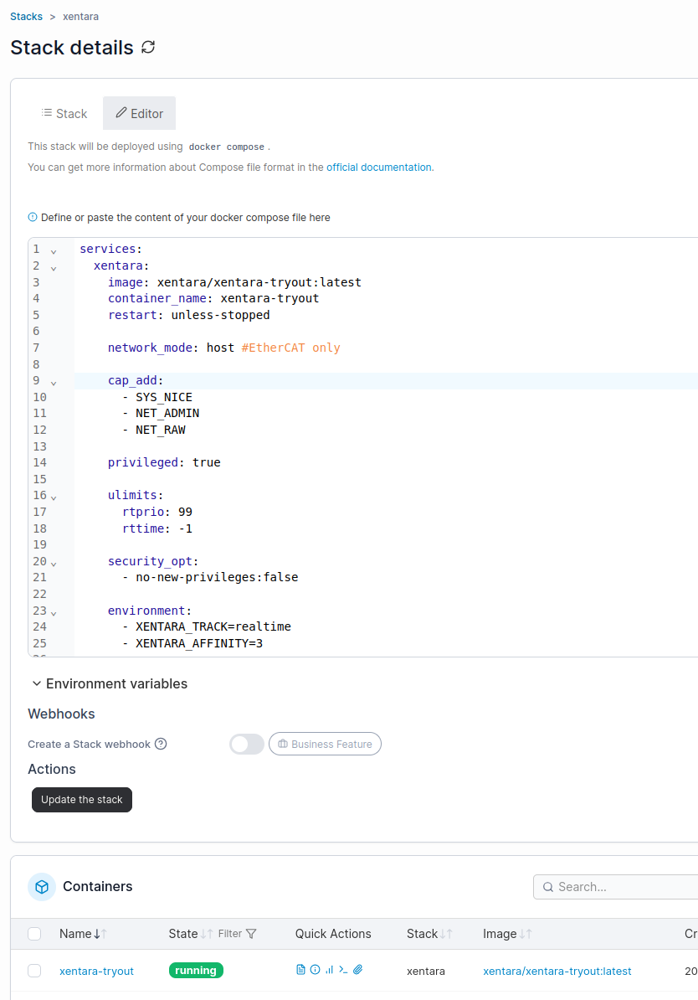

# wago-xentara-example

**Goal:** get [Xentara](https://www.xentara.io/) running on a WAGO edge
device, end to end, doing almost everything in a **web browser**. No prior
Xentara knowledge needed.

Two tracks, one shared setup:

| Track | Hardware | Apps |
|---|---|---|
| **Xentara example** - runtime + licence only | None | App 1 |
| **WAGO example** - real I/O on a WAGO coupler | WAGO EtherCAT coupler (+ 2 loopback wires for App 3) | App 2, App 3 |

Both tracks run on an edge computer or WAGO edge controller with Docker.
Start with the [deployment workflow overview](#deployment-workflow-overview)
for the shape of the whole process, or jump straight to
[Choose your app](#choose-your-app) below.

## Choose your app

App 3 is App 2 plus wiring - same RTT registers, same control, with the
K-Bus round trip added on top. App 1 is a separate model (Xentara's own
demo, no EtherCAT) - the recommended first stop to prove the runtime and
licence before touching hardware. Every app shares the same first three
steps (clone, deploy, license).

| | Model file | EtherCAT hardware | Loopback wiring | Licence skills needed | What you get |
|---|---|---|---|---|---|
| **App 1** - [Xentara demo](#app-1---xentara-demo-no-hardware) | [`schemas/sample-model.json`](schemas/sample-model.json) | Not needed | Not needed | Base runtime only | Synthetic waveforms (pulse, sine, ramp, noise) piped into a live debug inspector - confirms the runtime and licence work before you touch any wiring. |
| **App 2** - [WAGO RTT](#app-2---wago-rtt-ethercat--cycle-time) | [`model/template-rtt.json`](model/template-rtt.json) | Required (coupler on the wire) | Not needed | `CoE` (EtherCAT) + `CPP` (C++ control) | Your real I/O discovered and editable in the TUI, plus a live software cycle-time readout. A separate model from App 1, not an extension of it. |
| **App 3** - [WAGO RTT + K-Bus](#app-3---wago-rtt--k-bus-verified-hardware-round-trip) | [`model/template-rtt-kbus.json`](model/template-rtt-kbus.json) | Required (same as App 2) | Required (2 loopback wires) | Same as App 2 - no extra skill | Everything in App 2, plus a *verified hardware* round trip: a real digital and analog signal sent out and read back, timed for real. |

`CoE` and `CPP` are the licence skill names as they appear in your
`licences.json`'s `skills` array - check yours covers both (with a current
expiry date) before starting App 2 or 3.

> [!TIP]
> First time here? Run App 1 first. It proves the container, licence, and
> TUI all work before you involve any physical wiring - if something's wrong,
> you'll know it's not the EtherCAT bus.

> [!WARNING]
> **Never open a `template-*.json` file directly** - not in the Xentara
> Workbench, not by copying it straight to the device as `model.json`. Every
> template is a *generator input*, not a Xentara model: it contains the
> literal text `#CoE.Bus:EtherCAT Terminal` as a placeholder, which is
> required syntax for `xentara-ethercat-model-file-generator` (see
> [Xentara's own docs](https://docs.xentara.io/xentara-ethercat-driver/ethercat_driver_model_file_generator.html#ethercat_driver_model_file_generator_identifier))
> but isn't valid Xentara model JSON - opening it anywhere else fails with
> "expected a JSON object" at that line, every time. Apps 2 and 3 (Step C,
> below) always run the generator first; its output file, never the
> template itself, is what you import, deploy, or open in Workbench.

## Repo layout

```
docker-compose.yml                 # the runtime stack (paste into Portainer)
model/
  template-minimal.json            # generator input only - see warning above (discover + edit I/O)
  template-rtt.json                # generator input only - see warning above (+ live cycle-time metrics, App 2)
  template-rtt-kbus.json           # generator input only - see warning above (+ verified hardware round trip, App 3)
  example-rtt.json                 # template-rtt.json's real generator output, importable as-is (App 2)
  example-rtt-kbus.json            # template-rtt-kbus.json's real generator output, importable as-is (App 3)
  example-8di8do.json              # a complete, hand-written model for one WAGO 750-1506 (8DI/8DO) module
  README.md
control/
  ethercat-rtt-probe/               # C++ cycle-time probe (App 2)
  ethercat-kbus-rtt-probe/          # C++ cycle-time + hardware round-trip probe (App 3)
schemas/
  sample-model.json                # Xentara's own demo model (App 1) - a real, directly-loadable model
  schema-xentara-*.json            # official JSON Schema files for validation
scripts/
  rtt_websocket_test.py            # minimal WebSocket client, reads the RTT registers live
```

---

## Deployment workflow overview

High-level shape of the whole process - shared setup, then the no-hardware
or with-hardware track. Step-by-step commands are in the sections below; the
fully detailed diagram is in
[Deployment workflow (detailed reference)](#deployment-workflow-detailed-reference)
at the end of this document.



- **Shared setup** is one-time per device (see [Shared setup](#shared-setup-every-app-starts-here)).
- **No hardware** -> [App 1](#app-1---xentara-demo-no-hardware).
- **With hardware** -> [App 2](#app-2---wago-rtt-ethercat--cycle-time), then
  optionally [App 3](#app-3---wago-rtt--k-bus-verified-hardware-round-trip)
  for a verified hardware round trip.

---

## Shared setup (every app starts here)

### Step 0 - Clone this repo

```bash
git clone https://github.com/WagoAlex/wago-xentara-example.git
cd wago-xentara-example
```

Everything referenced below is a relative path from here.

> [!NOTE]
> Used GitHub's **Code -> Download ZIP** button instead of `git clone`? The
> extracted folder is named `wago-xentara-example-main`, not
> `wago-xentara-example` - `cd` into whatever name you actually got.

### Step 1 - Download + deploy the runtime (browser)

The runtime ships as a container image (`xentara/xentara-tryout`). Deploy it
with Portainer:

1. Open Portainer on the device (`https://<device-ip>:9443/`).
2. **Stacks -> Add stack -> Web editor**, name it `xentara`.
3. Paste the contents of [`docker-compose.yml`](./docker-compose.yml) and
   **Deploy the stack**. Portainer pulls the image (the "download") and
   starts it.



The stack runs with host networking (needed so the EtherCAT master in Apps 2
and 3 can reach the physical NIC - it costs nothing for App 1) and real-time
privileges. Set `XENTARA_AFFINITY` to a core that exists on your CPU; see the
comments in the compose file.

> [!NOTE]
> Portainer won't show a port link for this container - that's expected
> under host networking. You reach Xentara through its console and TUI
> (steps below).

### Step 2 - License it (browser)

Xentara is licensed per **node ID**. This is a condensed version of the
licensing steps in the [Xentara on Docker: Quick Start](https://kb.xentara.io/articles/xentara-on-docker-quick-start-guide)
guide (see [References](#references)) - follow that guide directly if
anything here doesn't match your version.

1. In Portainer: **Containers -> xentara-tryout -> Console -> Connect**
   (`/bin/bash`). This is a terminal in your browser.
2. Run:
   ```bash
   xentara-licence-id
   ```
   Copy the long ID it prints.
3. Go to the **Xentara Customer Portal** (`https://customerportal.xentara.io`,
   or the trial link the runtime prints on first start). Sign in and
   activate that node ID against your licence, or start a trial.
4. In Portainer, **Restart** the container.
5. Check **Logs** for `Model uses N of … data points from the Xentara
   licence` - that means licensing is working. (You'll also set a TUI
   password on first run via `xentara-password`, prompted in the console;
   restart after.)

Now pick your app.

---

## App 1 - Xentara demo (no hardware)

Confirms the runtime and TUI work, using Xentara's own sample model - a
signal generator producing six synthetic waveforms, fed into a debug
inspector. No EtherCAT bus, no wiring, no discovery step.

### Load the model

```bash
docker cp schemas/sample-model.json \
  xentara-tryout:/home/xentara/.config/xentara/model.json
```

Then restart the container in Portainer. Check **Logs** for `Using model
file …` and no errors.

### Watch it run

From Portainer: **Containers -> xentara-tryout -> Console -> Connect**, then:

```bash
xentara-tui --host localhost --port 8080 --user xentara
```

Navigate to the `Signals` group and watch `Pulse`, `Sine Wave`, `Triangle`,
`Saw-Tooth`, `Inverted Saw-Tooth`, and `Noise` update live, each on its own
waveform and period. The model also runs a `Debugging.Inspector` that dumps
every signal's value, quality, and timestamps to the container logs once per
cycle - `docker logs xentara-tryout` shows the same data outside the TUI.

That's the whole app. Move on to App 2 or 3 when you have EtherCAT hardware
to wire up.

---

## App 2 - WAGO RTT (EtherCAT + cycle time)

Your real I/O, discovered automatically, plus a live software cycle-time
readout.

### Step A - Network the EtherCAT NIC (browser)

Xentara's EtherCAT master takes over a NIC and speaks raw Layer-2 frames on
it, so that NIC must carry **no IP address**. A typical WAGO edge device has
several interfaces; a clean split is:

| Interface | Role | Address |
|---|---|---|
| One LAN port | Management (browser access to WBM / Portainer) | static or DHCP |
| Another LAN port | General uplink | DHCP |
| **EtherCAT port** | **EtherCAT** | **no IP** - leave unconfigured |

Set this in the device's **Web-Based Management (WBM)** UI under Networking
/ TCP/IP. Cable the EtherCAT port to the coupler. A link-local IPv6 on it is
normal; just make sure it has no IPv4 address.

Note the name of the EtherCAT interface (e.g. `eth0`, `enp3s0`, or `X11` on
WAGO devices) - you'll need it next. Call it `<your-nic>` below.

### Step B - Build and deploy the RTT probe

See [`control/ethercat-rtt-probe/README.md`](control/ethercat-rtt-probe/README.md)
for the build command. Once you have `libEtherCATRttProbe.so`, copy it in:

```bash
docker cp build-amd64/libEtherCATRttProbe.so \
  xentara-tryout:/home/xentara/.config/xentara/control/EtherCATRttProbe.so
```

(Use the `build-arm64` output on ARM targets like the PFC300.)

### Step C - Discover your I/O modules

Xentara scans the live EtherCAT bus and writes the correct model for
whatever terminals are actually present (tested against a WAGO 750-354
coupler). The scan needs the EtherCAT NIC exclusively, so Xentara is stopped
for it and the scan runs in a throwaway container. Copy
[`model/template-rtt.json`](./model/template-rtt.json) onto the device
(e.g. to `~/model/`), then:

```bash
docker stop xentara-tryout

docker run --rm --network host --privileged \
  --cap-add NET_RAW --cap-add NET_ADMIN --cap-add SYS_NICE \
  --entrypoint bash \
  -v ~/model:/out -w /out \
  xentara/xentara-tryout:latest -lc \
  'xentara-ethercat-model-file-generator \
     -i template-rtt.json -o model.json \
     -b <your-nic> -m online -n "EtherCAT Terminal" -v'

docker start xentara-tryout
```

- `<your-nic>` is the EtherCAT interface from Step A.
- The generator prints every channel it finds (index/subindex, type, name) -
  that printout **is** your module inventory.
- The `#CoE.Bus:EtherCAT Terminal` marker in the template tells it where to
  drop the discovered bus; the rest of the template (the 1 ms track, the RTT
  probe wiring) is preserved, so `model.json` comes out complete and
  runnable.

**Adding or moving terminals shifts addresses** - re-run this scan whenever
the physical row changes. That's exactly why you discover instead of
hand-writing addresses.

> [!WARNING]
> Don't open `template-rtt.json` / `template-rtt-kbus.json` / `template-minimal.json`
> directly in the Xentara Workbench or copy them straight to the device as
> `model.json` - the `#CoE.Bus:...` marker string is only meaningful to the
> generator; it's not valid Xentara model syntax and will fail to import
> ("expected a JSON object" at that line). Always run the generator first;
> its **output** file is the one you load, import, or deploy.

> [!IMPORTANT]
> The generator doesn't set the bus synchronization mode; set it to **free
> run** (the Xentara Workbench has a dropdown, or add `"synchronization":
> {"mode": "free run"}` to the `@Skill.CoE.Bus` object). See
> [`model/README.md`](model/README.md).

### Step D - Load the model

Put the **generated** `model.json` from Step C (not the template) where
Xentara reads it, and restart:

- **Xentara Workbench** (desktop GUI): connect it to the device
  (`<device-ip>`, port `8080`, user `xentara`, your password), open the
  generated `model.json`, confirm the bus is set to free run, and **Deploy**.
- **Or copy the file in directly:**
  ```bash
  docker cp ~/model/model.json \
    xentara-tryout:/home/xentara/.config/xentara/model.json
  ```

Check the container **Logs** for `Using model file …` and no errors.


Want to see a finished result before generating your own, or confirm the
Workbench opens a generator-output file correctly? Open
[`model/example-rtt.json`](model/example-rtt.json) - this repo's own actual
`template-rtt.json` output from a WAGO 750-354 coupler - directly in the
Workbench; it's a real model, not a template, and imports without running
anything. [`model/example-8di8do.json`](model/example-8di8do.json) is a
second, hand-written reference (one coupler + one WAGO 750-1506 module) if
you'd rather read one than generate one.

### Step E - Open the TUI and write an output (browser)

From Portainer: **Containers -> xentara-tryout -> Console -> Connect**, then:

```bash
xentara-tui --host localhost --port 8080 --user xentara
```


Navigate the model tree with the arrow keys, Enter to descend. The
[Xentara on Docker: Quick Start](https://kb.xentara.io/articles/xentara-on-docker-quick-start-guide)
guide covers the same TUI walkthrough if you want the vendor's version.


- **Read inputs:** open the discovered bus (or the `WagoIO` datapoint group
  if you added one) and watch input channels update live as you toggle
  physical inputs.

  

  

- **Write an output:** select a digital output, press the write key, type
  `true`, Enter. It reaches the coupler on the next bus cycle and the
  physical output switches. Type `false` to release it.

  

- **Analog values work the same way** - select an analog data point (e.g.
  `WagoIO.AO_2`) and write a raw count instead of `true`/`false`.

  | Browse | Write |
  |---|---|
  |  |  |

- **Cycle time:** open the `RTT` group for live `RttAvgMs` / `RttMinMs` /
  `RttMaxMs`.

  

  `RttSampleCount` climbs every cycle - proof the pipeline is actually
  running, not just idling on a loaded-but-stalled model.

  

> [!WARNING]
> Physical outputs switch real hardware. Know what's wired before toggling.

### The TUI isn't magic - it's a Web Service client

Editing a value is a single RPC over Xentara's WebSocket
(`wss://<host>:<port>/api/ws`, port 8080 by default - CBOR-encoded, HTTP
Basic auth): **write the value attribute (id `11`) with opcode `5`**. Any HMI
or script can drive I/O the same way; `xentara-tui` itself is a
self-contained reference client. Full protocol: the
[Xentara WebSocket API Specification](https://docs.xentara.io/xentara-websocket-api/).
A minimal Python client to test this is in
[`scripts/rtt_websocket_test.py`](scripts/rtt_websocket_test.py).

`RTT.RttLastMs`/`MinMs`/`MaxMs`/`AvgMs` measure the `step()`-to-`step()`
interval, i.e. how close the achieved cycle is to the configured Timer
period (browsable in the TUI as `Track EtherCAT Control.1ms Timer`, below).
That is a software/scheduling number, not a hardware one: it says nothing
about how long a physical output actually takes to reach a physical input.
For that, see App 3.


That's the whole app.

---

## App 3 - WAGO RTT + K-Bus (verified hardware round trip)

Everything in App 2, plus a real, wired, timed round trip: a digital output
flipped and read back through an input wired to it, and an analog output
stepped (and separately ramped) and read back the same way. This is the only
app here that tells you how long a value actually takes to reach physical
hardware and come back, not just how evenly the software cycles.

Follow **Steps A through E of App 2 first**, using
[`model/template-rtt-kbus.json`](model/template-rtt-kbus.json) and
[`control/ethercat-kbus-rtt-probe/`](control/ethercat-kbus-rtt-probe/) in
place of the RTT-only template and probe. Then:

### Step F - Wire the loopback

Two physical loopbacks on the same coupler:

| From | To |
|---|---|
| A spare digital output | A spare digital input |
| A spare analog output | A spare analog input |

Any pair works - this repo's own measurements used `DO_8ch_8 -> DI_8ch_1` and
`AO_1 -> AI_1` on a WAGO 750-354 coupler.

### Step G - Bind the wired channels

The discovered bus names channels after your specific hardware, so this
repo can't fill this in for you. In the loaded model, set the
`Connection.Do` / `Di` / `Ao` / `Ai` data points' `io` fields to the two
channels you actually wired (Xentara Workbench, or hand-edit and redeploy).
See [`control/ethercat-kbus-rtt-probe/README.md`](control/ethercat-kbus-rtt-probe/README.md)
for exactly which parameters the control expects, or open
[`model/example-rtt-kbus.json`](model/example-rtt-kbus.json) to see this
step already done - this repo's own `Connection.Do`/`Di`/`Ao`/`Ai` bound to
`DO_8ch_8`/`DI_8ch_1`/`AO_1`/`AI_1` on its WAGO 750-354 coupler.

### Step H - Watch the round trip in the TUI

Browse to `Control.EtherCATKbusRttProbe` to confirm it's loaded, or straight
to `RTT.KbusCycleAvgMs` (or any other `RTT.*` register) to watch the live
numbers:

| The control, as a Microservice | A live register value |
|---|---|
|  |  |

| Register group | Fields |
|---|---|
| `RTT.KbusConnected`, `RTT.KbusCycle*` | Digital DO->DI round trip |
| `RTT.AnalogConnected`, `RTT.AnalogStep*` | Analog instant-step round trip |
| `RTT.AnalogGradual*` | Analog gradual-ramp round trip |

`KbusConnected`/`AnalogConnected` only ever flip `false -> true`, on a real
observed match, never on a timeout - so a missing wire reads as "not
connected," never as a plausible-looking wrong number.

### What we measured on real hardware


Both charts: WAGO 750-354 coupler, 1ms EtherCAT Timer, ~13,000+ round trips
per bar, zero stalls. Takeaways:

- Wire propagation is sub-microsecond and not what limits this. The floor
  comes from the coupler's K-Bus scan needing a roughly constant **number
  of EtherCAT cycles** to flush (around 3-8, depending on the pair and
  approach) - not, as an earlier version of this note claimed, a constant
  wall-clock time independent of the Timer period. **That claim was
  wrong**: tested at 15 ms instead of 1 ms on this same hardware, the
  digital round trip cost ~4 cycles either way, but 4 cycles at 15 ms is
  ~60 ms wall clock, not ~7 ms. Slowing the Timer down slows real hardware
  response down too, roughly proportionally. Scan position (first vs. last
  channel) only adds a small offset on top of the per-cycle floor, at
  either period.
- **Analog step** lands at a similar per-cycle floor to the digital round
  trip (same scan mechanism).
- **Analog gradual** settles in roughly half the cycles of a step. The scan
  behaves like a pipeline: a step has to flush it from scratch, a ramp keeps
  it mostly full the whole way.

> [!IMPORTANT]
> Don't raise the Timer period as a "free" way to cut CPU/network load on
> this kind of bus - it's a direct trade against real round-trip latency.
> Keep it as fast as your actual application needs, not as slow as the
> K-Bus can nominally tolerate.

The analog tolerance (40 counts) and ramp step (100 counts/cycle) are
calibrated against this hardware's measured noise floor (~20-25 counts), not
guessed - a real DAC->wire->ADC loopback never reads back bit-exact like a
digital one does. Check your own noise floor before reusing these constants
on different hardware.

This is a separate control from `EtherCATRttProbe` rather than a change to
it, since it requires that specific wiring - `EtherCATRttProbe` (App 2)
stays generic and I/O-free for any deployment that doesn't have a loopback
available.

---

## Troubleshooting

| Symptom | Fix |
|---|---|
| Licence error in logs | Activate the node ID at customerportal.xentara.io, then restart. |
| TUI 401 after setting the password | Restart the container - the password is read only at startup. |
| TUI SSL error on 8080 | Try port **8006** instead. |
| Discovery: "can't open interface" | Another Xentara instance owns the NIC - stop it first. |
| Discovery: "connected devices less than configured" | Coupler state machine out of sync; run `xentara-ethercat-device-info --interface <your-nic>` once, then retry. |
| A control's `step()` never runs, no error | `controlPath` had a `control/` prefix - use the bare filename. |
| `multiple controls are enrolled` | One C++ control per instance; remove the extra `@Skill.CPP.Control`. |
| Config/model/licence gone after redeploy | No persistent volume - back up before recreating, or add bind mounts. |
| Jittery cycle time | Real-time thread preempted - fix `XENTARA_AFFINITY`, isolate the core, use an RT kernel. |

## Validated

This flow was run end to end on real hardware. Discovery correctly
enumerated a mixed row behind one coupler (analog, 8-channel digital, and
16-channel digital I/O), and the runtime reached operational with inputs
reading live. A digital output was written from the Web Service, the same
write path the TUI uses, and it switched and released as expected, holding a
steady 1 ms cycle.

## Deployment workflow (detailed reference)

Every step from both tracks, with the existing-app fast path that skips
straight to deploy. Node labels match the step headers below one for one -
follow the legend to jump to the exact instructions for any node.

```mermaid
%%{init: {'theme':'base', 'themeVariables': {
  'primaryColor':'#1F2837',
  'primaryTextColor':'#ffffff',
  'primaryBorderColor':'#6EC800',
  'lineColor':'#6EC800',
  'secondaryColor':'#EFF0F1',
  'secondaryTextColor':'#1F2837',
  'secondaryBorderColor':'#A5A8AF',
  'tertiaryColor':'#FFFFFF',
  'tertiaryTextColor':'#1F2837',
  'tertiaryBorderColor':'#DEDFE1',
  'fontFamily':'Segoe UI, Helvetica, Arial, sans-serif',
  'clusterBkg':'#EFF0F1',
  'clusterBorder':'#A5A8AF',
  'edgeLabelBackground':'#1F2837'
}}}%%
flowchart TB
    subgraph Setup["Shared setup - every app starts here"]
        direction TB
        S0("Step 0: clone the repo<br/>git clone https://github.com/WagoAlex/wago-xentara-example.git<br/>cd wago-xentara-example")
        S1("Step 1: deploy the stack<br/>Portainer → Stacks → Add stack → Web editor<br/>paste docker-compose.yml → Deploy the stack")
        S2("Step 2: license it<br/>Console: xentara-licence-id<br/>activate node ID at customerportal.xentara.io<br/>Restart → Logs: 'Model uses N of … data points'")
        S0 --> S1 --> S2
    end

    S2 --> Track{"Hardware<br/>available?"}

    Track -- "No" --> App1

    subgraph App1["App 1 - Xentara example, no hardware"]
        direction TB
        A1("Load the model<br/>docker cp schemas/sample-model.json<br/>xentara-tryout:/home/xentara/.config/xentara/model.json<br/>Restart → Logs: 'Using model file …'")
        A2("Watch it run<br/>xentara-tui --host localhost --port 8080 --user xentara<br/>browse Signals: Pulse, Sine Wave, Triangle, Noise, …")
        A1 --> A2
    end

    Track -- "Yes" --> Reuse{"Already have a built<br/>.so and a model.json?"}

    Reuse -- "No - first time" --> App2Build
    Reuse -- "Yes - reuse them" --> FastPath

    subgraph App2Build["App 2 - WAGO RTT: control/ethercat-rtt-probe/"]
        direction TB
        BA("Step A: network the NIC<br/>device WBM → Networking/TCP-IP<br/>EtherCAT port: no IPv4, note interface name (e.g. X11)")
        BB("Step B: build + copy the probe<br/>build → libEtherCATRttProbe.so<br/>docker cp build-amd64/libEtherCATRttProbe.so<br/>xentara-tryout:/home/xentara/.config/xentara/control/EtherCATRttProbe.so")
        BC("Step C: discover I/O<br/>docker stop xentara-tryout<br/>xentara-ethercat-model-file-generator<br/>-i template-rtt.json -o model.json -b your-nic -m online<br/>docker start xentara-tryout")
        BD("Step D: load the model<br/>docker cp model.json<br/>xentara-tryout:/home/xentara/.config/xentara/model.json<br/>Restart → Logs: 'Using model file …'")
        BE("Step E: open the TUI<br/>xentara-tui --host localhost --port 8080 --user xentara<br/>browse WagoIO, write true/false, watch RTT.RttAvgMs")
        BA --> BB --> BC --> BD --> BE
    end

    subgraph FastPath["Existing-app fast path"]
        direction TB
        FA("Reuse the .so + model.json<br/>e.g. model/example-rtt.json<br/>docker cp both files in as above → Restart<br/>skip Steps A - D entirely")
    end

    App2Build --> App2Done{"Add verified hardware<br/>round trip?"}
    FastPath --> App2Done

    App2Done -- "No" --> Done("Done - App 2 running")
    App2Done -- "Yes, wire loopback" --> App3Prep

    App3Prep("Redo Steps A - E with<br/>model/template-rtt-kbus.json and<br/>control/ethercat-kbus-rtt-probe/")

    subgraph App3["App 3 - WAGO RTT + K-Bus"]
        direction TB
        CF("Step F: wire the loopback<br/>e.g. DO_8ch_8 → DI_8ch_1<br/>e.g. AO_1 → AI_1")
        CG("Step G: bind wired channels<br/>set Connection.Do / Di / Ao / Ai<br/>io fields to the two channels wired above")
        CH("Step H: watch the round trip<br/>browse RTT.KbusCycleAvgMs,<br/>RTT.AnalogStep*, RTT.AnalogGradual*")
        CF --> CG --> CH
    end

    App3Prep --> CF
```



| Node | Jump to |
|---|---|
| Step 0 | [Clone this repo](#step-0---clone-this-repo) |
| Step 1 | [Download + deploy the runtime](#step-1---download--deploy-the-runtime-browser) |
| Step 2 | [License it](#step-2---license-it-browser) |
| App 1 - Load the model | [App 1: Load the model](#load-the-model) |
| App 1 - Watch it run | [App 1: Watch it run](#watch-it-run) |
| Step A | [Network the EtherCAT NIC](#step-a---network-the-ethercat-nic-browser) |
| Step B | [Build and deploy the RTT probe](#step-b---build-and-deploy-the-rtt-probe) |
| Step C | [Discover your I/O modules](#step-c---discover-your-io-modules) |
| Step D | [Load the model](#step-d---load-the-model) |
| Step E | [Open the TUI and write an output](#step-e---open-the-tui-and-write-an-output-browser) |
| Step F | [Wire the loopback](#step-f---wire-the-loopback) |
| Step G | [Bind the wired channels](#step-g---bind-the-wired-channels) |
| Step H | [Watch the round trip in the TUI](#step-h---watch-the-round-trip-in-the-tui) |

- **Steps 0-2** are one-time per device; App 1 needs nothing past Step 2.
- **Steps A-D** only need re-running when the physical terminal row changes
  (rediscover) or the control logic changes (rebuild). The full generator
  command (`-n "EtherCAT Terminal" -v`, etc.) is in
  [Step C](#step-c---discover-your-io-modules).
- **Existing-app fast path**: redeploying a control you already built and a
  `model.json` you already have (e.g.
  [`model/example-rtt.json`](model/example-rtt.json)) skips Steps A-D
  entirely - copy the `.so` and the model in, restart, done.
- **App 3** reuses Steps A-E of App 2 verbatim, just swapping in
  [`model/template-rtt-kbus.json`](model/template-rtt-kbus.json) and
  [`control/ethercat-kbus-rtt-probe/`](control/ethercat-kbus-rtt-probe/)
  for the RTT-only template and probe, before Steps F-H.

## References

- [Xentara on Docker: Quick Start](https://kb.xentara.io/articles/xentara-on-docker-quick-start-guide)
- [EtherCAT Model File Generator](https://docs.xentara.io/xentara-ethercat-driver/ethercat_driver_model_file_generator.html)
- [The Xentara Model](https://docs.xentara.io/xentara/xentara_model.html)
- [WebSocket API Specification](https://docs.xentara.io/xentara-websocket-api/)
- [Xentara Downloads](https://docs.xentara.io/xentara/xentara_downloads.html) - official JSON schema files and the sample model, mirrored in [`schemas/`](schemas/)

## License

This example (the C++ probes, models, compose, and docs) is licensed under
the **Mozilla Public License 2.0** - see [`LICENSE`](./LICENSE). Xentara
itself and the `xentara/*` container images are licensed separately by
Xentara GmbH and are not covered by this license.
