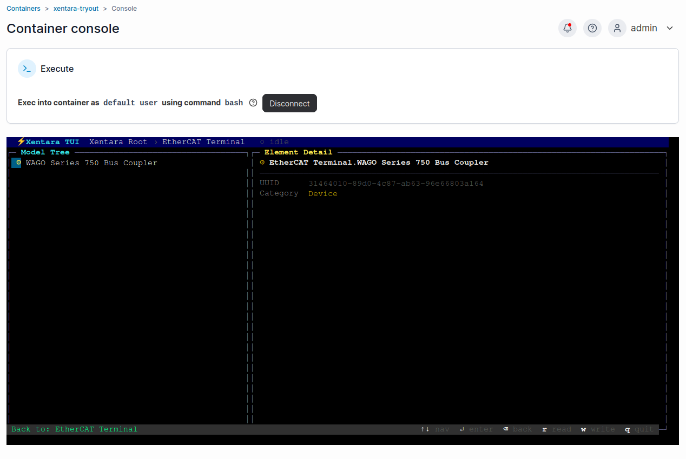
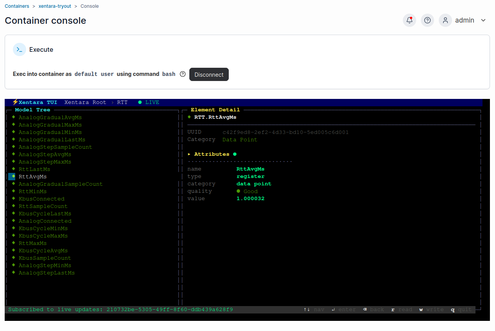
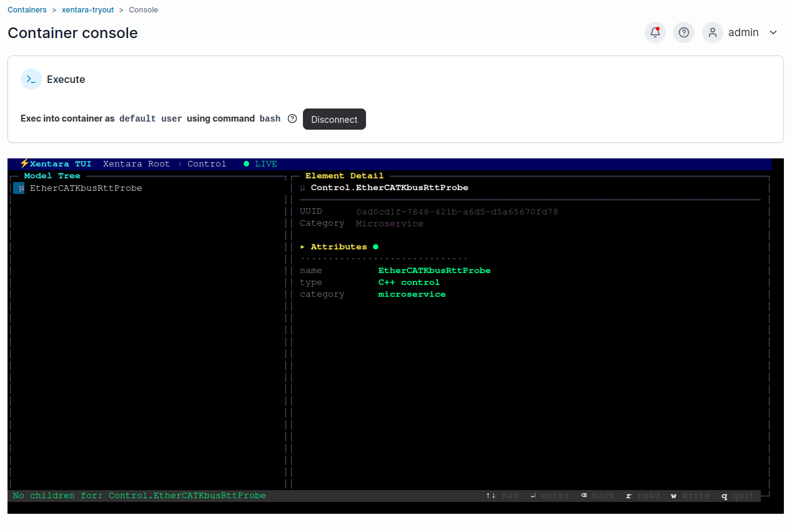
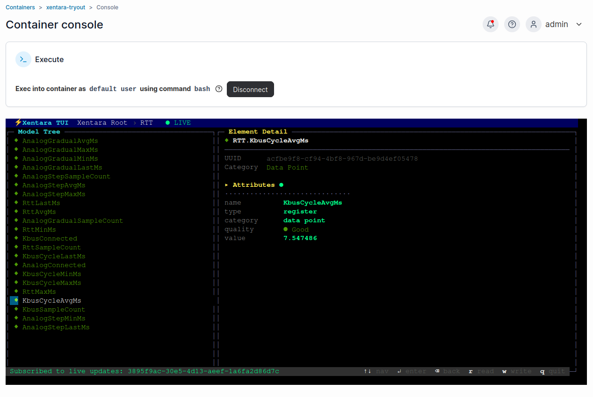
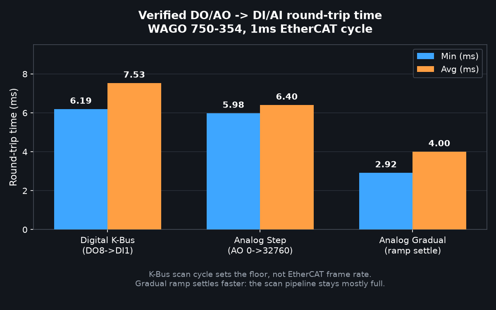
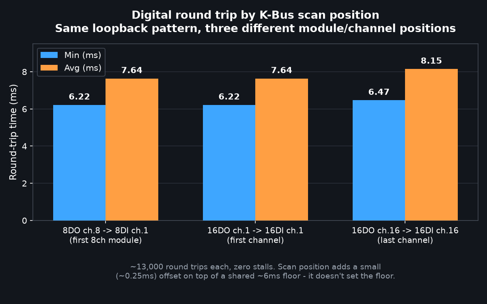

# wago-xentara-example

A first-time-user walkthrough for running [Xentara](https://www.xentara.io/)
on a WAGO edge device against a real EtherCAT bus - from **downloading the
runtime** to **writing a physical output from the built-in TUI** - doing almost
everything in a **web browser**, with only a couple of typed commands.

You don't need any prior Xentara knowledge. Bring a WAGO EtherCAT coupler (any
model) with at least one digital I/O terminal, and an edge computer (or WAGO
edge controller) running Docker.

## What you'll end up with

- The Xentara runtime running in a container, licensed.
- Your actual EtherCAT I/O modules discovered automatically, in whatever mix
  of digital and analog terminals and whatever order they're physically
  wired, without you having to guess addresses.
- The TUI open, showing live input values, and you toggling an output that
  switches real hardware.
- (Optional) a live cycle-time readout via a small C++ probe.

## The whole thing is 6 steps

| # | Step | Where | CLI? |
|---|------|-------|------|
| 1 | Set the network (EtherCAT NIC gets no IP) | WBM (browser) | none |
| 2 | Download + deploy the runtime | Portainer (browser) | none |
| 3 | License it | Customer Portal (browser) + 1 command | one |
| 4 | Discover your I/O modules | Portainer console | one |
| 5 | Load the model | Portainer / Workbench | copy files |
| 6 | Open the TUI and write an output | Portainer console | none |

That's **two commands** total (plus copying files in). Everything else is
point-and-click.

## Repo layout

```
docker-compose.yml                 # the runtime stack (paste into Portainer)
model/
  template-minimal.json            # discover + edit I/O (no custom code)   ← start here
  template-rtt.json                # + live cycle-time metrics
  example-8di8do.json              # a complete hand-written model to learn from
  README.md
control/ethercat-rtt-probe/        # optional C++ cycle-time probe
control/ethercat-kbus-rtt-probe/   # optional: cycle-time + verified DO->DI hardware round trip
```

---

## Step 1 - Network (browser)

Xentara's EtherCAT master takes over a NIC and speaks raw Layer-2 frames on it,
so that NIC must carry **no IP address**. A typical WAGO edge device has several
interfaces; a clean split is:

| Interface | Role | Address |
|---|---|---|
| One LAN port | Management (browser access to WBM / Portainer) | static or DHCP |
| Another LAN port | General uplink | DHCP |
| **EtherCAT port** | **EtherCAT** | **no IP** - leave unconfigured |

Set this in the device's **Web-Based Management (WBM)** UI under Networking /
TCP/IP. Cable the EtherCAT port to the coupler. A link-local IPv6 on it is
normal; just make sure it has no IPv4 address.

Note the name of the EtherCAT interface (e.g. `eth0`, `enp3s0`, or `X11` on
WAGO devices) - you'll need it in step 4. Call it `<your-nic>` below.

---

## Step 2 - Download + deploy the runtime (browser)

The runtime ships as a container image (`xentara/xentara-tryout`). Deploy it
with Portainer:

1. Open Portainer on the device (`https://<device-ip>:9443/`).
2. **Stacks -> Add stack -> Web editor**, name it `xentara`.
3. Paste the contents of [`docker-compose.yml`](./docker-compose.yml) and
   **Deploy the stack**. Portainer pulls the image (the "download") and starts
   it.

The stack runs with host networking (so it can reach the EtherCAT NIC) and
real-time privileges. Set `XENTARA_AFFINITY` to a core that exists on your CPU;
see the comments in the compose file.

> Portainer won't show a port link for this container - that's expected under
> host networking. You reach Xentara through its console and TUI (steps 3, 6).

---

## Step 3 - License it (browser + one command)

Xentara is licensed per **node ID**. This is a condensed version of the
licensing steps in the [Xentara on Docker: Quick Start](https://kb.xentara.io/articles/xentara-on-docker-quick-start-guide)
guide (see [References](#references)) - follow that guide directly if anything here doesn't match your version.

1. In Portainer: **Containers -> xentara-tryout -> Console -> Connect**
   (`/bin/bash`). This is a terminal in your browser.
2. Run - **command 1 of 2**:
   ```bash
   xentara-licence-id
   ```
   Copy the long ID it prints.
3. Go to the **Xentara Customer Portal** (`https://customerportal.xentara.io`,
   or the trial link the runtime prints on first start). Sign in and activate
   that node ID against your licence, or start a trial.
4. In Portainer, **Restart** the container.
5. Check **Logs** for `Model uses N of … data points from the Xentara licence`
   - that means licensing is working. (You'll also set a TUI password on first
   run via `xentara-password`, prompted in the console; restart after.)

---

## Step 4 - Discover your I/O modules (one command)

Xentara scans the live EtherCAT bus and writes the correct model for whatever
terminals are actually present (tested against a WAGO 750-354 coupler).

The scan needs the EtherCAT NIC exclusively, so Xentara is stopped for it and
the scan runs in a throwaway container. First copy
[`model/template-minimal.json`](./model/template-minimal.json) onto the device
(e.g. to `~/model/`). Then - **command 2 of 2**:

```bash
docker stop xentara-tryout                     

docker run --rm --network host --privileged \
  --cap-add NET_RAW --cap-add NET_ADMIN --cap-add SYS_NICE \
  --entrypoint bash \
  -v ~/model:/out -w /out \
  xentara/xentara-tryout:latest -lc \
  'xentara-ethercat-model-file-generator \
     -i template-minimal.json -o model.json \
     -b <your-nic> -m online -n "EtherCAT Terminal" -v'

docker start xentara-tryout                    
```

- `<your-nic>` is the EtherCAT interface from step 1.
- The generator prints every channel it finds (index/subindex, type, name) -
  that printout **is** your module inventory.
- The `#CoE.Bus:EtherCAT Terminal` marker in the template tells it where to drop
  the discovered bus; the rest of the template (the 1 ms track that runs the bus
  loop) is preserved, so `model.json` comes out complete and runnable.

**Adding or moving terminals shifts addresses** - re-run this scan whenever the
physical row changes. That's exactly why you discover instead of hand-writing
addresses. (Want cycle-time metrics too? Use `template-rtt.json` here instead,
and build/deploy the probe in `control/ethercat-rtt-probe/` first.)

### One setting on the discovered bus

The generator doesn't set the bus synchronization mode; set it to **free run**
(the Xentara Workbench has a dropdown, or add `"synchronization": {"mode":
"free run"}` to the `@Skill.CoE.Bus` object). See `model/README.md`.

---

## Step 5 - Load the model

Put the generated `model.json` where Xentara reads it
(`~/.config/xentara/model.json` inside the container) and restart:

- **No CLI:** use the **Xentara Workbench** (desktop GUI). Connect it to the
  device (`<device-ip>`, port `8080`, user `xentara`, your password), import the
  discovered bus, set free run, and **Deploy**.
- **Minimal CLI:** copy the file in and restart the container in Portainer:
  ```bash
  docker cp ~/model/model.json xentara-tryout:/home/xentara/.config/xentara/model.json
  ```
  (If you're using the RTT probe, also copy its `.so` into
  `.../control/EtherCATRttProbe.so` - see `control/ethercat-rtt-probe/README.md`.)

Check the container **Logs** for `Using model file …` and no errors.

`model/example-8di8do.json` shows what a finished model looks like end to end
(bus + I/O `@DataPoint` aliases + track) if you'd rather read one than generate.

---

## Step 6 - Open the TUI and write an output (browser)

From Portainer: **Containers -> xentara-tryout -> Console -> Connect**, then:

```bash
xentara-tui --host localhost --port 8080 --user xentara
```


(Port **8080**.) Navigate the model tree with the arrow keys, Enter to descend.
The [Xentara on Docker: Quick Start](https://kb.xentara.io/articles/xentara-on-docker-quick-start-guide)
guide covers the same TUI walkthrough if you want the vendor's version.



- **Read inputs:** open the discovered bus (or the `WagoIO` datapoint group if
  you added one) and watch input channels update live as you toggle physical
  inputs.

  

- **Write an output:** select a digital output, press the write key, type
  `true`, Enter. It reaches the coupler on the next bus cycle and the physical
  output switches. Type `false` to release it.

  

- **Analog values work the same way** - select an analog data point (e.g.
  `WagoIO.AO_2`) and write a raw count instead of `true`/`false`.

  | Browse | Write |
  |---|---|
  |  |  |

- **(If using the probe) cycle time:** open the `RTT` group for live
  `RttAvgMs` / `RttMinMs` / `RttMaxMs`.

  

> Physical outputs switch real hardware. Know what's wired before toggling.

### The TUI isn't magic - it's a Web Service client

Editing a value is a single RPC over Xentara's WebSocket (`wss://<host>:<port>/api/ws`,
port 8080 by default - CBOR-encoded, HTTP Basic auth): **write the value attribute
(id `11`) with opcode `5`**. Any HMI or script can drive I/O the same way;
`xentara-tui` itself is a self-contained reference client. Full protocol: the
[Xentara WebSocket API Specification](https://docs.xentara.io/xentara-websocket-api/).
A minimal Python client to test this is in
[`scripts/rtt_websocket_test.py`](scripts/rtt_websocket_test.py).

---

## Optional: a verified hardware round trip (K-Bus)

`RTT.RttLastMs`/`MinMs`/`MaxMs`/`AvgMs` (from `EtherCATRttProbe`, above) measure
the step()-to-step() interval, i.e. how close the achieved cycle is to the
configured Timer period (browsable in the TUI as `Track EtherCAT
Control.1ms Timer`, below). That is a software/scheduling number, not a
hardware one: it says nothing about how long a physical output actually
takes to reach a physical input.


`control/ethercat-kbus-rtt-probe/` adds that missing measurement: a real
DO->DI round trip and a real AO->AI round trip, each gated on an actual
connectivity check (`KbusConnected`/`AnalogConnected` only ever flip
false -> true, on a real observed match, never on a timeout) so a missing
wire reads as "not connected," never as a plausible-looking wrong number.

It shows up in the TUI like any other control and register group - browse
to `Control.EtherCATKbusRttProbe` to confirm it's loaded, or straight to
`RTT.KbusCycleAvgMs` (or any of the other `RTT.*` registers) to watch the
live numbers:

| The control, as a Microservice | A live register value |
|---|---|
|  |  |





Both charts: WAGO 750-354 coupler, 1ms EtherCAT Timer, ~13,000+ round
trips per bar, zero stalls. Takeaways:

- The **K-Bus scan cycle**, not EtherCAT frame rate or wire propagation,
  sets the ~6ms floor - shortening the Timer period below that doesn't
  help, and scan position (first vs. last channel) only adds a small
  offset on top of it.
- **Analog step** lands at the same floor as the digital round trip (same
  scan mechanism).
- **Analog gradual** settles in roughly half the time of a step. The scan
  behaves like a pipeline: a step has to flush it from scratch, a ramp
  keeps it mostly full the whole way.

Required wiring: `DO_8ch_8` -> `DI_8ch_1`, `AO_1` -> `AI_1` (two physical
loopbacks on the same coupler). Parameter bindings needed in the model -
`Do`/`Di`/`Ao`/`Ai` plus one register per stat listed below - are in
`control/ethercat-kbus-rtt-probe/src/EtherCATKbusRttProbe.cpp`.

| Register group | Fields |
|---|---|
| `RTT.KbusConnected`, `RTT.KbusCycle*` | Digital DO8->DI1 round trip |
| `RTT.AnalogConnected`, `RTT.AnalogStep*` | Analog instant-step round trip |
| `RTT.AnalogGradual*` | Analog gradual-ramp round trip |

The analog tolerance (40 counts) and ramp step (100 counts/cycle) are
calibrated against this hardware's measured noise floor (~20-25 counts), not
guessed - a real DAC->wire->ADC loopback never reads back bit-exact like a
digital one does. Check your own noise floor before reusing these constants
on different hardware.

This is a separate control from `EtherCATRttProbe` rather than a change to
it, since it requires that specific wiring - `EtherCATRttProbe` stays
generic and I/O-free for any deployment that doesn't have a loopback
available.

## The only commands you type

1. `xentara-licence-id` - get the node ID to activate.
2. `xentara-ethercat-model-file-generator … -b <your-nic> -m online` - discover
   your modules.
3. `xentara-tui --host localhost --port 8080 --user xentara` - open the TUI.

Plus `xentara-password` once, and a couple of `docker cp` / restart clicks.
Everything else is WBM, Portainer, and the TUI/Workbench in a browser.

## Troubleshooting

| Symptom | Fix |
|---|---|
| Licence error in logs | Activate the node ID at customerportal.xentara.io, then restart. |
| TUI 401 after setting the password | Restart the container - the password is read only at startup. |
| TUI SSL error on 8080 | Try port **8006** instead. |
| Discovery: "can't open interface" | Another Xentara instance owns the NIC - stop it first. |
| Discovery: "connected devices less than configured" | Coupler state machine out of sync; run `xentara-ethercat-device-info --interface <your-nic>` once, then retry. |
| A control's `step()` never runs, no error | `controlPath` had a `control/` prefix - use the bare filename. |
| `multiple controls are enrolled` | One C++ control per instance; remove the extra `@Skill.CPP.Control`. |
| Config/model/licence gone after redeploy | No persistent volume - back up before recreating, or add bind mounts. |
| Jittery cycle time | Real-time thread preempted - fix `XENTARA_AFFINITY`, isolate the core, use an RT kernel. |

## Validated

This flow was run end to end on real hardware. Discovery correctly enumerated
a mixed row behind one coupler (analog, 8-channel digital, and 16-channel
digital I/O), and the runtime reached operational with inputs reading live. A
digital output was written from the Web Service, the same write path the TUI
uses, and it switched and released as expected, holding a steady 1 ms cycle.

## References

- [Xentara on Docker: Quick Start](https://kb.xentara.io/articles/xentara-on-docker-quick-start-guide)
- [EtherCAT Model File Generator](https://docs.xentara.io/xentara-ethercat-driver/ethercat_driver_model_file_generator.html)
- [The Xentara Model](https://docs.xentara.io/xentara/xentara_model.html)
- [WebSocket API Specification](https://docs.xentara.io/xentara-websocket-api/)

## License

This example (the C++ probe, models, compose, and docs) is licensed under the
**Mozilla Public License 2.0** - see [`LICENSE`](./LICENSE). Xentara itself and
the `xentara/*` container images are licensed separately by Xentara GmbH and
are not covered by this license.
