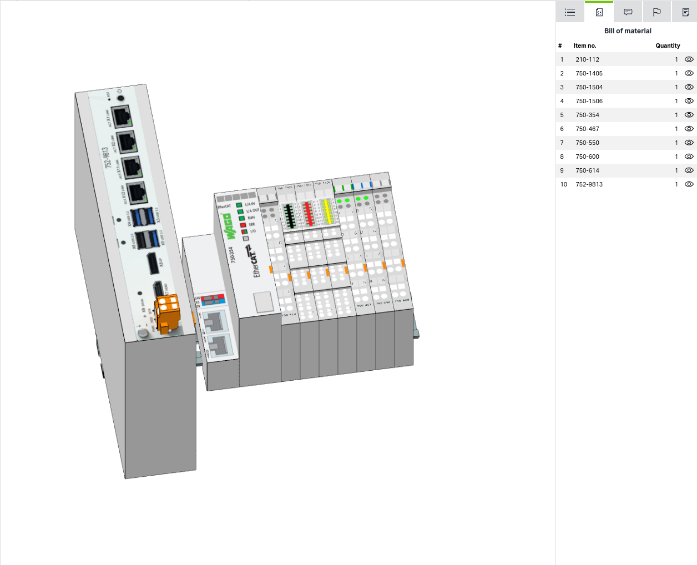
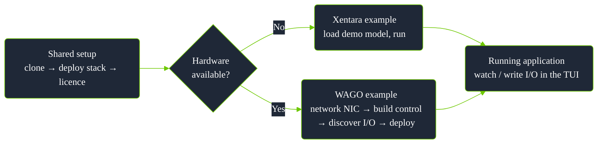

# wago-xentara-example

**Goal:** get [Xentara](https://www.xentara.io/) running on a WAGO edge
device, end to end, doing almost everything in a **web browser**. No prior
Xentara knowledge needed.

This README is the hub: it gets you set up and points you at the right
guide. Each app has its own page under [`docs/`](docs/).

## Table of contents

- [Prerequisites](#prerequisites)
- [Two tracks, one shared setup](#two-tracks-one-shared-setup)
- [Choose your app](#choose-your-app)
- [Repo layout](#repo-layout)
- [Deployment workflow overview](#deployment-workflow-overview)
- [Shared setup (every app starts here)](#shared-setup-every-app-starts-here)
  - [Step 0 - Clone this repo](#step-0---clone-this-repo)
  - [Step 1 - Download + deploy the runtime](#step-1---download--deploy-the-runtime-browser)
  - [Opening the container console](#opening-the-container-console)
  - [Step 2 - License it](#step-2---license-it-browser)
- [Guides](#guides)
- [Validated](#validated)
- [References](#references)
- [License](#license)

## Prerequisites

**Every app** needs a device running **Docker** with **Portainer**
installed and reachable at `https://<device-ip>:9443/`. Portainer runs on
any edge computer - this guide deploys *into* it, it doesn't install it.
That is the whole requirement for the Xentara track (App 1).

**The WAGO track (App 2 / App 3 / App 4)** also needs WAGO hardware:

- A WAGO edge device (a 752-9xxx-class controller) with a WAGO EtherCAT
  coupler (e.g. a 750-354) and at least one I/O terminal.

  
- **App 3** also: two loopback wires (a spare DO->DI and a spare AO->AI).
- **App 4** also: an MQTT broker (e.g. Mosquitto) and a running
  [wago-hailo-example](https://github.com/WagoAlex/wago-hailo-example)
  publishing to `inference/yolov5m-results`, plus a **native Xentara
  install** (not the `xentara-tryout` Docker container Apps 1-3 use) with
  `xentara-mqtt-client >= 2.0+2.2` (check via
  `dpkg -l | grep xentara-mqtt-client`). The native install and any Docker
  container both want exclusive use of the EtherCAT NIC, so only one of
  "Apps 1-3" or "App 4" can run at a time.

## Two tracks, one shared setup

| Track | Hardware | Apps |
|---|---|---|
| **Xentara example** - runtime + licence only | None | App 1 |
| **WAGO example** - real I/O on a WAGO coupler | WAGO EtherCAT coupler (+ 2 loopback wires for App 3; + an MQTT broker and [wago-hailo-example](https://github.com/WagoAlex/wago-hailo-example) for App 4) | App 2, App 3, App 4 |

Every app starts with the same three steps (clone, deploy, license) in
[Shared setup](#shared-setup-every-app-starts-here). From there, pick your
track and open the matching guide under [`docs/`](docs/). For the shape of
the whole process at a glance, see
[Deployment workflow overview](#deployment-workflow-overview). Writing your
own control instead of just running these examples? Do App 2 first, then see
[Blueprint - build your own C++ and EtherCAT control](docs/blueprint.md).

## Choose your app

App 3 (WAGO example) is App 2 plus wiring - same RTT registers, same
control, with the K-Bus round trip added on top. App 1 (Xentara example) is
a separate model, Xentara's own demo with no EtherCAT involved - the
recommended first stop to prove the runtime and licence work before you
touch hardware. App 4 reuses App 2's coupler but replaces loopback wiring
and TUI writes with a real external system: three outputs driven by an AI
detection feed over MQTT instead.

Each app maps to one guide, one C++ control, one model file, and a set of
licence skills. The linked guide carries the full walkthrough.

| App / guide | Control (`control/`) | Model (`model/`) | Hardware | Licence | What it is |
|---|---|---|---|---|---|
| **App 1** - [Xentara demo](docs/app-demo.md) | *(none)* | [`sample-model.json`](schemas/sample-model.json) | None | Base | Runtime + TUI smoke test: six synthetic waveforms in a live inspector. **Start here.** |
| **App 2** - [WAGO RTT](docs/app-rtt.md) | [`ethercat-rtt-probe/`](control/ethercat-rtt-probe/) | [`template-rtt.json`](model/template-rtt.json) | EtherCAT coupler | `CoE` + `CPP` | Your real I/O discovered and editable in the TUI, plus a live cycle-time readout. |
| **App 3** - [WAGO RTT + K-Bus](docs/app-rtt-kbus.md) | [`ethercat-kbus-rtt-probe/`](control/ethercat-kbus-rtt-probe/) | [`template-rtt-kbus.json`](model/template-rtt-kbus.json) | Coupler + 2 loopback wires | `CoE` + `CPP` | App 2 plus a verified, timed hardware round trip (digital + analog). |
| **App 4** - [MQTT Payload Control](docs/app-mqtt-payload-control.md) | [`mqtt-payload-control/`](control/mqtt-payload-control/) | [`template-mqtt-payload-control.json`](model/template-mqtt-payload-control.json) | Coupler + MQTT feed, native install | `CoE` + `CPP` + `MQTT` | Three physical outputs driven live by an AI detection feed over MQTT. |
| **Blueprint** - [build your own](docs/blueprint.md) | [`blueprint-example/`](control/blueprint-example/) | [`example-blueprint.json`](model/example-blueprint.json) | None | Base | A minimal no-hardware control plus a recipe for writing your own. |

`CoE`, `CPP`, and `MQTT` are the licence skill names as they appear in your
`licences.json`'s `skills` array - check yours covers what you need (`CoE` +
`CPP` for Apps 2/3, add `MQTT` for App 4, each with a current expiry date)
before starting.

> [!TIP]
> First time here? Run App 1 first. It proves the container, licence, and
> TUI all work before you involve any physical wiring - if something's wrong,
> you'll know it's not the EtherCAT bus.

> [!WARNING]
> **Never open a `template-*.json` file directly** - not in the Xentara
> Workbench, not by copying it straight to the device as `model.json`. Every
> template is a *generator input*, not a Xentara model: it contains the
> literal text `#CoE.Bus:EtherCAT Terminal` as a placeholder, which is
> required syntax for `xentara-ethercat-model-file-generator` (see
> [Xentara's own docs](https://docs.xentara.io/xentara-ethercat-driver/ethercat_driver_model_file_generator.html#ethercat_driver_model_file_generator_identifier))
> but isn't valid Xentara model JSON - opening it anywhere else fails with
> "expected a JSON object" at that line, every time. Apps 2, 3, and 4
> (Step C / Step K in their guides) always run the generator first; its
> output file, never the template itself, is what you import, deploy, or
> open in Workbench.

## Repo layout

```
docker-compose.yml                 # the runtime stack (paste into Portainer)
README.md                          # this hub: setup + choose-your-app
docs/
  app-demo.md                      # App 1 - Xentara demo (no hardware)
  app-rtt.md                       # App 2 - WAGO RTT (EtherCAT + cycle time)
  app-rtt-kbus.md                  # App 3 - WAGO RTT + K-Bus (verified round trip)
  app-mqtt-payload-control.md      # App 4 - MQTT Payload Control (AI-driven outputs)
  blueprint.md                     # build your own C++ and EtherCAT control
  workflow-reference.md            # every step in one diagram + jump table
  troubleshooting.md               # symptom -> fix, grouped by app
model/
  template-minimal.json            # generator input only - see warning above (discover + edit I/O)
  template-rtt.json                # generator input only - see warning above (+ live cycle-time metrics, App 2)
  template-rtt-kbus.json           # generator input only - see warning above (+ verified hardware round trip, App 3)
  template-mqtt-payload-control.json # generator input only - see warning above (AI-driven outputs, App 4, native only)
  example-rtt.json                 # template-rtt.json's real generator output, importable as-is (App 2)
  example-rtt-kbus.json            # template-rtt-kbus.json's real generator output, importable as-is (App 3)
  example-8di8do.json              # reference model, not tied to an app: one WAGO 750-1506 (8DI/8DO) module, hand-written
  example-blueprint.json           # minimal no-hardware model for the Blueprint control
  example-mqtt-payload-control.json # template-mqtt-payload-control.json's real generator output (App 4, native only)
  README.md
control/
  ethercat-rtt-probe/               # C++ cycle-time probe (App 2)
  ethercat-kbus-rtt-probe/          # C++ cycle-time + hardware round-trip probe (App 3)
  blueprint-example/                # minimal reference control for the Blueprint guide
  mqtt-payload-control/             # C++ control: MQTT detection payload -> 3 physical DO outputs (App 4)
schemas/
  sample-model.json                # Xentara's own demo model (App 1) - a real, directly-loadable model
  schema-xentara-*.json            # official JSON Schema files for validation
scripts/
  rtt_websocket_test.py            # minimal WebSocket client, reads the RTT registers live
```

---

## Deployment workflow overview

The process below at a glance. For exact commands, see
[Shared setup](#shared-setup-every-app-starts-here) and your chosen app
guide; for every step in one diagram, see
[Deployment workflow (detailed reference)](docs/workflow-reference.md).



- **Shared setup** is one-time per device (see [Shared setup](#shared-setup-every-app-starts-here)).
- **No hardware** -> [App 1](docs/app-demo.md).
- **With hardware** -> [App 2](docs/app-rtt.md), then optionally
  [App 3](docs/app-rtt-kbus.md) for a verified hardware round trip, or
  [App 4](docs/app-mqtt-payload-control.md) to drive outputs from a real
  external AI feed over MQTT instead.

---

## Shared setup (every app starts here)

### Step 0 - Clone this repo

```bash
git clone https://github.com/WagoAlex/wago-xentara-example.git
cd wago-xentara-example
```

Everything referenced below is a relative path from here.

> [!NOTE]
> Used GitHub's **Code -> Download ZIP** button instead of `git clone`? The
> extracted folder is named `wago-xentara-example-main`, not
> `wago-xentara-example` - `cd` into whatever name you actually got.

### Step 1 - Download + deploy the runtime (browser)

The runtime ships as a container image (`xentara/xentara-tryout`). Deploy it
with Portainer:

1. Open Portainer on the device (`https://<device-ip>:9443/`).
2. **Stacks -> Add stack -> Web editor**, name it `xentara`.
3. Paste the contents of [`docker-compose.yml`](./docker-compose.yml) and
   **Deploy the stack**. Portainer pulls the image (the "download") and
   starts it.


The stack runs with host networking (needed so the EtherCAT master in Apps 2
and 3 can reach the physical NIC - it costs nothing for App 1) and real-time
privileges. Set `XENTARA_AFFINITY` to a core that exists on your CPU; see the
comments in the compose file.

> [!NOTE]
> Portainer won't show a port link for this container - that's expected
> under host networking. You reach Xentara through its console and TUI
> (steps below).

### Opening the container console

Several steps below need a terminal inside the running container. Always the
same path: **Containers -> xentara-tryout -> Console -> Connect** (shell
`/bin/bash`) - this opens a terminal in your browser, no SSH needed. Later
steps just link back here as "open the container console."

### Step 2 - License it (browser)

Xentara is licensed per **node ID**. This condenses the licensing steps from
Xentara's own [Quick Start guide](https://kb.xentara.io/articles/xentara-on-docker-quick-start-guide) -
use that guide directly if anything here doesn't match your version.

1. [Open the container console](#opening-the-container-console).
2. Run:
   ```bash
   xentara-licence-id
   ```
   Copy the long ID it prints.
3. Go to the **Xentara Customer Portal** (`https://customerportal.xentara.io`,
   or the trial link the runtime prints on first start). Sign in and
   activate that node ID against your licence, or start a trial.
4. In Portainer, **Restart** the container.
5. Check **Logs** for `Model uses N of … data points from the Xentara
   licence` - that means licensing is working. (You'll also set a TUI
   password on first run via `xentara-password`, prompted in the console;
   restart after.)

Now pick your app below.

---

## Guides

Setup done? Open your guide:

| Guide | For |
|---|---|
| [App 1 - Xentara demo](docs/app-demo.md) | No hardware. Prove the runtime, licence, and TUI work. Start here. |
| [App 2 - WAGO RTT](docs/app-rtt.md) | Real I/O on a WAGO coupler + a live cycle-time readout. |
| [App 3 - WAGO RTT + K-Bus](docs/app-rtt-kbus.md) | App 2 plus a verified, wired, timed hardware round trip. |
| [App 4 - MQTT Payload Control](docs/app-mqtt-payload-control.md) | Physical outputs driven live by an AI detection feed over MQTT (native install). |
| [Blueprint](docs/blueprint.md) | Write your own C++ and EtherCAT control from scratch. |
| [Deployment workflow (detailed reference)](docs/workflow-reference.md) | Every step from both tracks in one diagram, with a jump table. |
| [Troubleshooting](docs/troubleshooting.md) | Symptom -> fix, grouped by app. |

## Validated

This flow was run end to end on real hardware. Discovery correctly
enumerated a mixed row behind one coupler (analog, 8-channel digital, and
16-channel digital I/O), and the runtime reached operational with inputs
reading live. A digital output was written from the Web Service, the same
write path the TUI uses, and it switched and released as expected, holding a
steady 1 ms cycle. Per-app "confirmed on hardware" notes live in each guide.

## References

- [Xentara on Docker: Quick Start](https://kb.xentara.io/articles/xentara-on-docker-quick-start-guide)
- [EtherCAT Model File Generator](https://docs.xentara.io/xentara-ethercat-driver/ethercat_driver_model_file_generator.html)
- [The Xentara Model](https://docs.xentara.io/xentara/xentara_model.html)
- [WebSocket API Specification](https://docs.xentara.io/xentara-websocket-api/)
- [Xentara Downloads](https://docs.xentara.io/xentara/xentara_downloads.html) - official JSON schema files and the sample model, mirrored in [`schemas/`](schemas/)

## License

This example (the C++ probes, models, compose, and docs) is licensed under
the **Mozilla Public License 2.0** - see [`LICENSE`](./LICENSE). Xentara
itself and the `xentara/*` container images are licensed separately by
Xentara GmbH and are not covered by this license.
