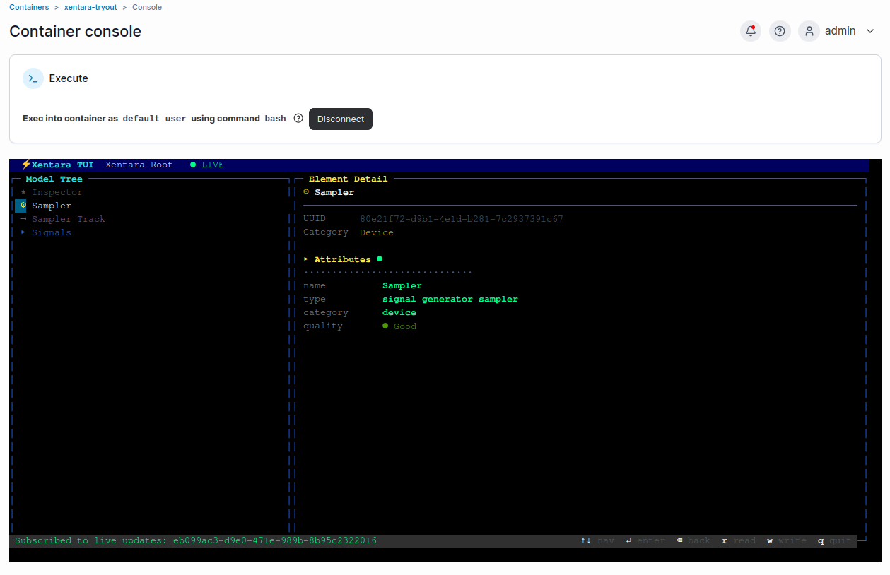
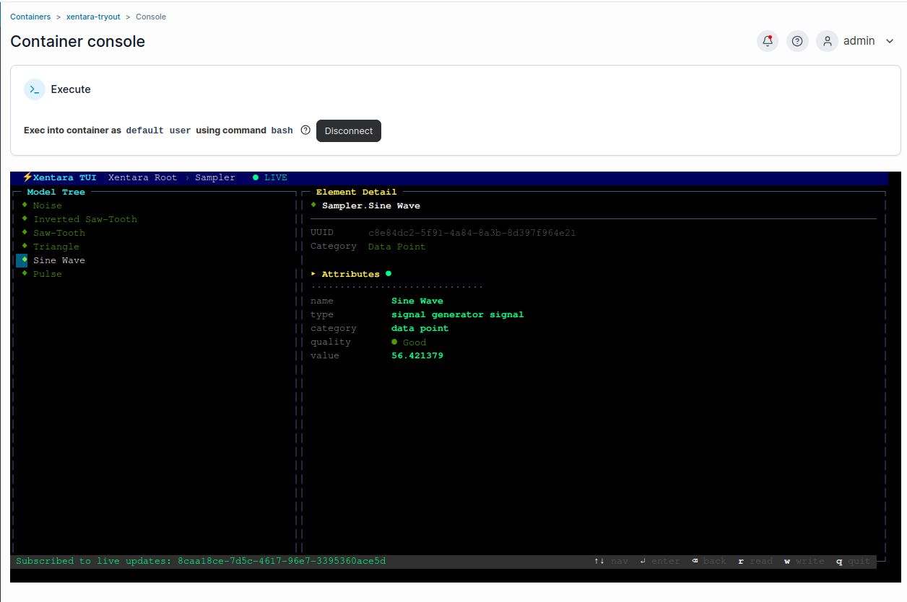

# App 1 - Xentara demo (no hardware)

← [Back to README](../README.md) · Complete [Shared setup](../README.md#shared-setup-every-app-starts-here) (clone, deploy, license) first.

*Xentara example track.* Confirms the runtime and TUI work, using Xentara's
own sample model - a signal generator producing six synthetic waveforms, fed
into a debug inspector. No EtherCAT bus, no wiring, no discovery step.

## Load the model

```bash
docker cp schemas/sample-model.json \
  xentara-tryout:/home/xentara/.config/xentara/model.json
```

Then restart the container in Portainer. Check **Logs** for `Using model
file …` and no errors.

## Watch it run

[Open the container console](../README.md#opening-the-container-console), then:

```bash
xentara-tui --host localhost --port 8080 --user xentara
```



Navigate to the `Signals` group and watch `Pulse`, `Sine Wave`, `Triangle`,
`Saw-Tooth`, `Inverted Saw-Tooth`, and `Noise` update live, each on its own
waveform and period. The model also runs a `Debugging.Inspector` that dumps
every signal's value, quality, and timestamps to the container logs once per
cycle - `docker logs xentara-tryout` shows the same data outside the TUI.



That's the whole app. Move on to [App 2](app-rtt.md) or
[App 3](app-rtt-kbus.md) when you have EtherCAT hardware to wire up.
