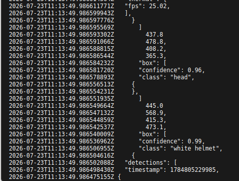
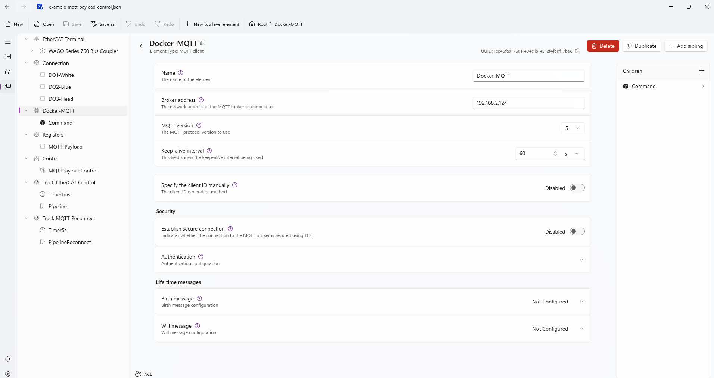
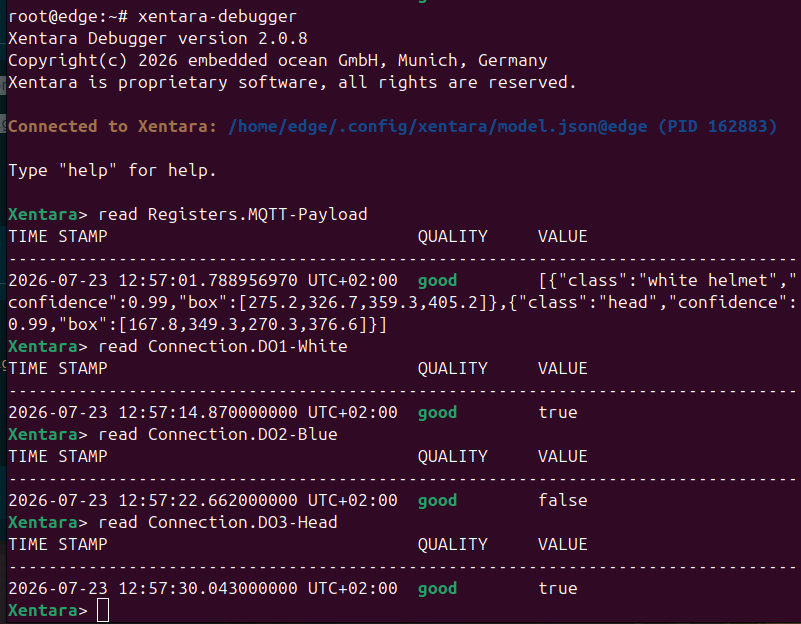

# App 4 - MQTT Payload Control (AI-driven outputs)

← [Back to README](../README.md) · Complete [Shared setup](../README.md#shared-setup-every-app-starts-here) first.

*WAGO example track, extended with a real external system.* Three physical
digital outputs on the same WAGO coupler, driven live by helmet-detection
results from [wago-hailo-example](https://github.com/WagoAlex/wago-hailo-example)
- a Hailo-8 YOLOv5m pipeline - arriving over MQTT, instead of loopback
wiring or a TUI write.

This is the same general pattern as Apps 2 and 3: I/O comes in over a bus,
gets aliased into flat `@DataPoint`s, a `@Skill.CPP.Control` turns external
data into decisions, and everything is scheduled by pairing a `@Timer` with
a `@Pipeline` in a `@Track` - with an MQTT feed standing in for physical
inputs.

> [!IMPORTANT]
> **This app runs on the native Xentara install, not the `xentara-tryout`
> Docker container the rest of this repo uses.** Its model needs
> `xentara-mqtt-client >= 2.0+2.2` for the `asJSONText` payload property;
> `xentara/xentara-tryout:latest` currently ships `2.0+2.1`, which rejects
> the model outright (`unknown member "asJSONText"`). The native install
> and the Docker container also both want exclusive use of the EtherCAT
> NIC - only one can run at a time. The native install's layout this app
> assumes: control and model under `~/.config/xentara/`, run as the
> systemd unit `xentara@<user>.service`.

## Step I - Run the inference source (external)

Start an MQTT broker (e.g. Mosquitto) reachable from the device, then run
[wago-hailo-example](https://github.com/WagoAlex/wago-hailo-example)
pointed at it (see that repo's own Quick Start) so it's publishing to
`inference/yolov5m-results` once per frame - a shape like:

```json
{
  "timestamp": 1719600000000,
  "fps": 28.4,
  "detections": [
    { "class": "white helmet", "confidence": 0.91, "box": [120.0, 45.0, 310.0, 280.0] }
  ]
}
```

Xentara only reads the `detections` array (see Step L) - it ignores
`timestamp`, `fps`, `confidence`, and `box` entirely.



> [!IMPORTANT]
> wago-hailo-example's real class labels are `"blue helmet"`, `"head"`,
> `"red helmet"`, `"white helmet"`, `"yellow helmet"` (from its own
> `yolov5m-helmet.txt`) - a generic `"helmet"` class won't match anything
> below. See
> [`control/mqtt-payload-control/README.md`](../control/mqtt-payload-control/README.md)
> for exactly which three of those five labels this control acts on.

## Step J - Build the control

See [`control/mqtt-payload-control/README.md`](../control/mqtt-payload-control/README.md)
for the build command. Once you have `libMQTTPayloadControl.so`, copy it
into the **native** instance's control directory (not a Docker container):

```bash
scp build-amd64/libMQTTPayloadControl.so \
  <user>@<device-ip>:~/.config/xentara/control/MQTTPayloadControl.so
```

(Use the `build-arm64` output on ARM targets like the PFC300.)

## Step K - Discover your I/O modules

> [!WARNING]
> Don't hand-load [`model/example-mqtt-payload-control.json`](../model/example-mqtt-payload-control.json)
> as-is on different hardware. It's this repo's own coupler's real,
> discovered addresses - not a generic template. On a different physical
> row (even a different terminal count on the *same* coupler type), those
> addresses point at the wrong process-data offsets. This bit us during
> development: a hand-written version of this model had its digital output
> addresses shifted by an analog module that got added to the row later -
> the write succeeded and read back correctly, but landed on the analog
> module's word instead of the real output. Always discover fresh.

Same procedure as [App 2's Step C](app-rtt.md#step-c---discover-your-io-modules),
against [`model/template-mqtt-payload-control.json`](../model/template-mqtt-payload-control.json):

```bash
docker run --rm --network host --privileged \
  --cap-add NET_RAW --cap-add NET_ADMIN --cap-add SYS_NICE \
  --entrypoint bash \
  -v ~/model:/out -w /out \
  xentara/xentara-tryout:latest -lc \
  'xentara-ethercat-model-file-generator \
     -i template-mqtt-payload-control.json -o model.json \
     -b <your-nic> -m online -n "EtherCAT Terminal" -v'
```

Both the native install and any Docker container want exclusive use of the
EtherCAT NIC - stop whichever one is currently running before this scan.
As with Step C, set the generated bus to **free run** synchronization if
the generator doesn't already carry it over (see
[`model/README.md`](../model/README.md)).

## Step L - Load the model

Edit the generated `model.json`'s `@Skill.MQTT.Client.brokerAddress` to
your own broker (this repo's committed copy points at its own test
device), then copy it to the native instance and restart:

```bash
scp model.json <user>@<device-ip>:~/.config/xentara/model.json
ssh <user>@<device-ip> 'sudo systemctl restart xentara@<user>.service'
```

Check `journalctl -u xentara@<user>.service` for `Using model file …` and
no errors.



## Step M - Watch it react

```bash
xentara-debugger
```

(run directly on the device - no container to attach to). Read
`Registers.MQTT-Payload` to see the raw detection JSON arrive live, and
`Connection.DO1-White` / `DO2-Blue` / `DO3-Head` to see them flip as
matching classes appear in frame. `Track MQTT Reconnect` retries the
broker connection every 5s, independently of the 1ms EtherCAT track - the
same two-tracks-at-different-speeds pattern App 2's cycle-time track uses,
just applied to a slower, non-real-time concern.



> [!TIP]
> No hardware feed handy? Publish a test message by hand and watch the
> outputs react:
> ```bash
> mosquitto_pub -h <broker> -t inference/yolov5m-results \
>   -m '{"detections":[{"class":"white helmet"}]}'
> ```

## Confirmed on real hardware


Confirmed end to end against a live camera feed on real WAGO 750-354
hardware: genuine `"white helmet"` and `"head"` detections correctly set
`Connection.DO1-White` / `DO3-Head` to `true` (with `DO2-Blue` correctly
staying `false` with no blue helmet in frame), tracked live frame-to-frame,
and the physical outputs were visually confirmed switching. See
[`control/mqtt-payload-control/README.md`](../control/mqtt-payload-control/README.md#validated)
for the two real bugs this surfaced (stale EtherCAT addresses, and the
Docker-image/native-install `mqtt-client` version skew) and how they were
fixed.
