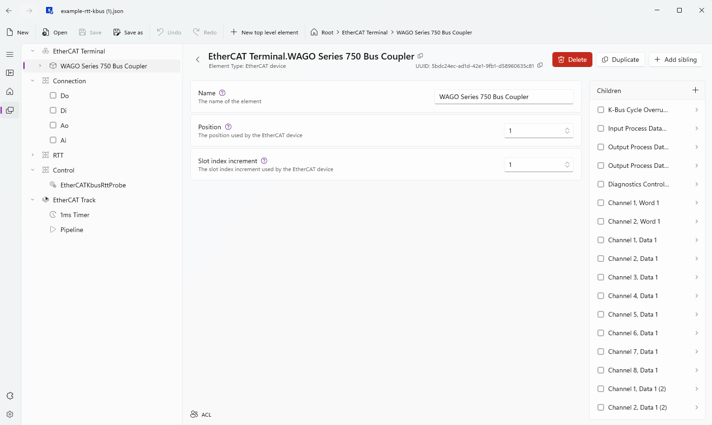

# App 3 - WAGO RTT + K-Bus (verified hardware round trip)

← [Back to README](../README.md) · Complete [Shared setup](../README.md#shared-setup-every-app-starts-here) first.

*WAGO example track.* Everything in App 2, plus a real, wired, timed round trip: a digital output
flipped and read back through an input wired to it, and an analog output
stepped (and separately ramped) and read back the same way. This is the only
app here that tells you how long a value actually takes to reach physical
hardware and come back, not just how evenly the software cycles.

Follow **[Steps A through E of App 2](app-rtt.md) first**, using
[`model/template-rtt-kbus.json`](../model/template-rtt-kbus.json) and
[`control/ethercat-kbus-rtt-probe/`](../control/ethercat-kbus-rtt-probe/) in
place of the RTT-only template and probe. Then:

## Step F - Wire the loopback

Two physical loopbacks on the same coupler:

| From | To |
|---|---|
| A spare digital output | A spare digital input |
| A spare analog output | A spare analog input |

Any pair works - this repo's own measurements used `DO_8ch_8 -> DI_8ch_1` and
`AO_1 -> AI_1` on a WAGO 750-354 coupler.

## Step G - Bind the wired channels

The discovered bus names channels after your specific hardware, so this
repo can't fill this in for you. In the loaded model, set the
`Connection.Do` / `Di` / `Ao` / `Ai` data points' `io` fields to the two
channels you actually wired (Xentara Workbench, or hand-edit and redeploy).
See [`control/ethercat-kbus-rtt-probe/README.md`](../control/ethercat-kbus-rtt-probe/README.md)
for exactly which parameters the control expects, or open
[`model/example-rtt-kbus.json`](../model/example-rtt-kbus.json) to see this
step already done - this repo's own `Connection.Do`/`Di`/`Ao`/`Ai` bound to
`DO_8ch_8`/`DI_8ch_1`/`AO_1`/`AI_1` on its WAGO 750-354 coupler.

## Step H - Watch the round trip in the TUI

Browse to `Control.EtherCATKbusRttProbe` to confirm it's loaded, or straight
to `RTT.KbusCycleAvgMs` (or any other `RTT.*` register) to watch the live
numbers:

| The control, as a Microservice | A live register value |
|---|---|
|  |  |

| Register group | Fields |
|---|---|
| `RTT.KbusConnected`, `RTT.KbusCycle*` | Digital DO->DI round trip |
| `RTT.AnalogConnected`, `RTT.AnalogStep*` | Analog instant-step round trip |
| `RTT.AnalogGradual*` | Analog gradual-ramp round trip |

`KbusConnected`/`AnalogConnected` only ever flip `false -> true`, on a real
observed match, never on a timeout - so a missing wire reads as "not
connected," never as a plausible-looking wrong number.

## What we measured on real hardware

Both charts: WAGO 750-354 coupler, 1ms EtherCAT Timer, ~13,000+ round trips
per bar, zero stalls. Takeaways:

- Wire propagation is sub-microsecond and not what limits this. The floor
  comes from the coupler's K-Bus scan needing a roughly constant **number
  of EtherCAT cycles** to flush (around 3-8, depending on the pair and
  approach) - not, as an earlier version of this note claimed, a constant
  wall-clock time independent of the Timer period. **That claim was
  wrong**: tested at 15 ms instead of 1 ms on this same hardware, the
  digital round trip cost ~4 cycles either way, but 4 cycles at 15 ms is
  ~60 ms wall clock, not ~7 ms. Slowing the Timer down slows real hardware
  response down too, roughly proportionally. Scan position (first vs. last
  channel) only adds a small offset on top of the per-cycle floor, at
  either period.
- **Analog step** lands at a similar per-cycle floor to the digital round
  trip (same scan mechanism).
- **Analog gradual** settles in roughly half the cycles of a step. The scan
  behaves like a pipeline: a step has to flush it from scratch, a ramp keeps
  it mostly full the whole way.

> [!IMPORTANT]
> Don't raise the Timer period as a "free" way to cut CPU/network load on
> this kind of bus - it's a direct trade against real round-trip latency.
> Keep it as fast as your actual application needs, not as slow as the
> K-Bus can nominally tolerate.

The analog tolerance (40 counts) and ramp step (100 counts/cycle) are
calibrated against this hardware's measured noise floor (~20-25 counts), not
guessed - a real DAC->wire->ADC loopback never reads back bit-exact like a
digital one does. Check your own noise floor before reusing these constants
on different hardware.

This is a separate control from `EtherCATRttProbe` rather than a change to
it, since it requires that specific wiring - `EtherCATRttProbe` (App 2)
stays generic and I/O-free for any deployment that doesn't have a loopback
available.
