# App 2 - WAGO RTT (EtherCAT + cycle time)

← [Back to README](../README.md) · Complete [Shared setup](../README.md#shared-setup-every-app-starts-here) (clone, deploy, license) first.

*WAGO example track.* Your real I/O, discovered automatically, plus a live
software cycle-time readout.

> [!WARNING]
> **Never open a `template-*.json` file directly** - it's a *generator
> input*, not a Xentara model. Steps C below always runs the generator
> first; its output file, never the template itself, is what you import,
> deploy, or open in Workbench. See
> [Choose your app](../README.md#choose-your-app) for the full explanation.

## Step A - Network the EtherCAT NIC (browser)

Xentara's EtherCAT master takes over a NIC and speaks raw Layer-2 frames on
it, so that NIC must carry **no IP address**. A typical WAGO edge device has
several interfaces; a clean split is:

| Interface | Role | Address |
|---|---|---|
| One LAN port | Management (browser access to WBM / Portainer) | static or DHCP |
| Another LAN port | General uplink | DHCP |
| **EtherCAT port** | **EtherCAT** | **no IP** - leave unconfigured |

Set this in the device's **Web-Based Management (WBM)** UI under Networking
/ TCP/IP. Cable the EtherCAT port to the coupler. A link-local IPv6 on it is
normal; just make sure it has no IPv4 address.

Note the name of the EtherCAT interface (e.g. `eth0`, `enp3s0`, or `X11` on
WAGO devices) - you'll need it next. Call it `<your-nic>` below.

## Step B - Build and deploy the RTT probe

See [`control/ethercat-rtt-probe/README.md`](../control/ethercat-rtt-probe/README.md)
for the build command. Once you have `libEtherCATRttProbe.so`, copy it in:

```bash
docker cp build-amd64/libEtherCATRttProbe.so \
  xentara-tryout:/home/xentara/.config/xentara/control/EtherCATRttProbe.so
```

(Use the `build-arm64` output on ARM targets like the PFC300.)

## Step C - Discover your I/O modules

Xentara scans the live EtherCAT bus and writes the correct model for
whatever terminals are actually present (tested against a WAGO 750-354
coupler). The scan needs the EtherCAT NIC exclusively, so Xentara is stopped
for it and the scan runs in a throwaway container. Copy
[`model/template-rtt.json`](../model/template-rtt.json) onto the device
(e.g. to `~/model/`), then:

```bash
docker stop xentara-tryout

docker run --rm --network host --privileged \
  --cap-add NET_RAW --cap-add NET_ADMIN --cap-add SYS_NICE \
  --entrypoint bash \
  -v ~/model:/out -w /out \
  xentara/xentara-tryout:latest -lc \
  'xentara-ethercat-model-file-generator \
     -i template-rtt.json -o model.json \
     -b <your-nic> -m online -n "EtherCAT Terminal" -v'

docker start xentara-tryout
```

- `<your-nic>` is the EtherCAT interface from Step A.
- The generator prints every channel it finds (index/subindex, type, name) -
  that printout **is** your module inventory.
- The `#CoE.Bus:EtherCAT Terminal` marker in the template tells it where to
  drop the discovered bus; the rest of the template (the 1 ms track, the RTT
  probe wiring) is preserved, so `model.json` comes out complete and
  runnable.

**Adding or moving terminals shifts addresses** - re-run this scan whenever
the physical row changes. That's exactly why you discover instead of
hand-writing addresses.

> [!WARNING]
> Load the **output** `model.json` from the command above, never the
> `template-*.json` itself - see the warning under
> [Choose your app](../README.md#choose-your-app) for why.

> [!IMPORTANT]
> The generator doesn't set the bus synchronization mode; set it to **free
> run** (the Xentara Workbench has a dropdown, or add `"synchronization":
> {"mode": "free run"}` to the `@Skill.CoE.Bus` object). See
> [`model/README.md`](../model/README.md).

## Step D - Load the model

Put the **generated** `model.json` from Step C (not the template) where
Xentara reads it, and restart:

- **Xentara Workbench** (desktop GUI): connect it to the device
  (`<device-ip>`, port `8080`, user `xentara`, your password), open the
  generated `model.json`, confirm the bus is set to free run, and **Deploy**.
- **Or copy the file in directly:**
  ```bash
  docker cp ~/model/model.json \
    xentara-tryout:/home/xentara/.config/xentara/model.json
  ```

Check the container **Logs** for `Using model file …` and no errors.

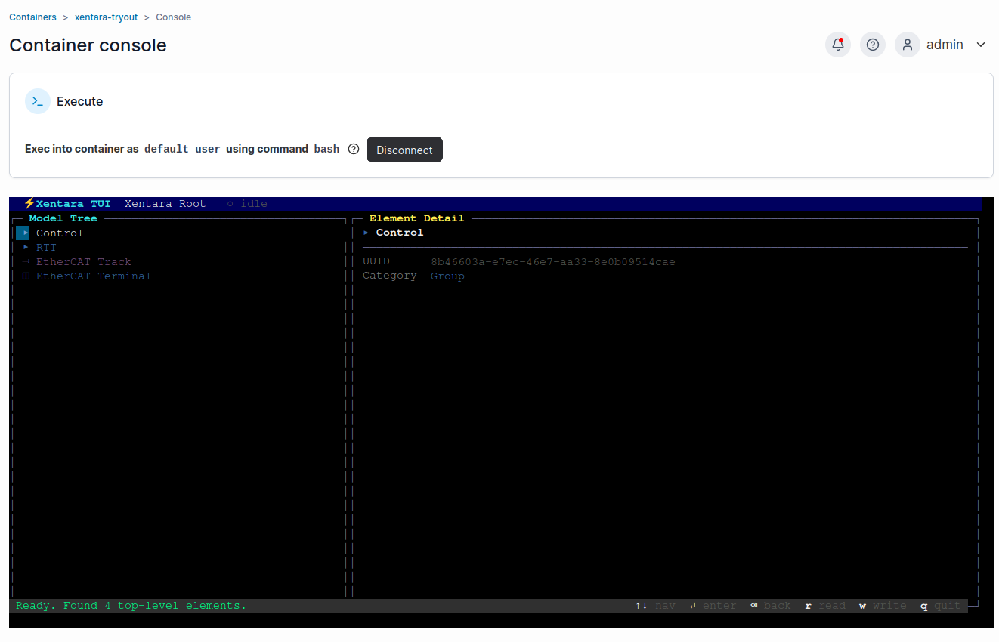

Want to see a finished result before generating your own, or confirm the
Workbench opens a generator-output file correctly? Open
[`model/example-rtt.json`](../model/example-rtt.json) - this repo's own actual
`template-rtt.json` output from a WAGO 750-354 coupler - directly in the
Workbench; it's a real model, not a template, and imports without running
anything. [`model/example-8di8do.json`](../model/example-8di8do.json) is a
second, hand-written reference (one coupler + one WAGO 750-1506 module) if
you'd rather read one than generate one.

## Step E - Open the TUI and write an output (browser)

[Open the container console](../README.md#opening-the-container-console), then:

```bash
xentara-tui --host localhost --port 8080 --user xentara
```

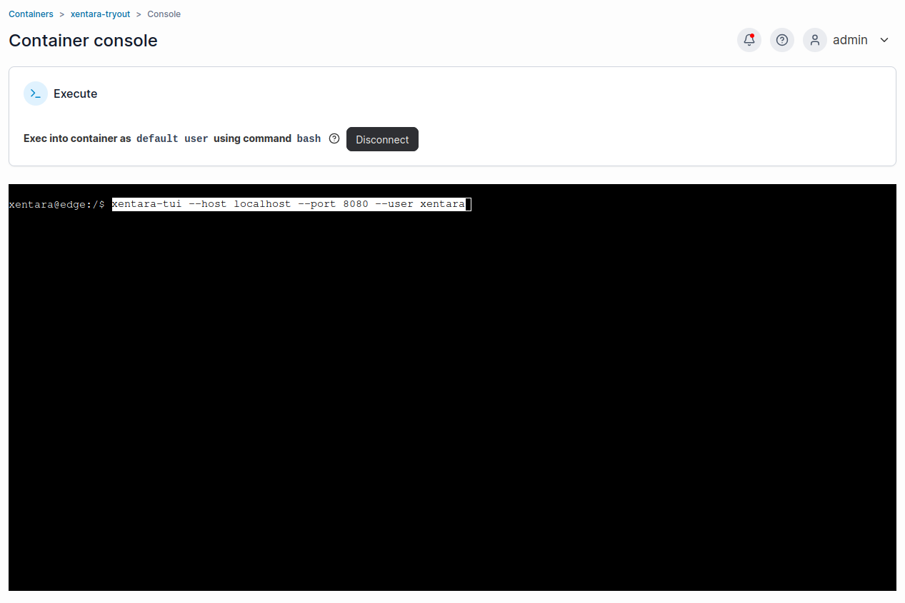

Navigate the model tree with the arrow keys, Enter to descend.

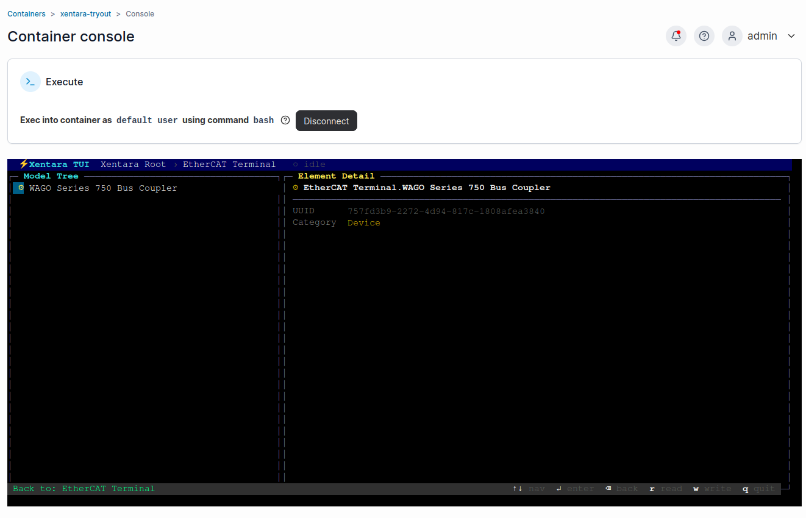

- **Read inputs:** open the discovered bus (or the `WagoIO` datapoint group
  if you added one) and watch input channels update live as you toggle
  physical inputs.

  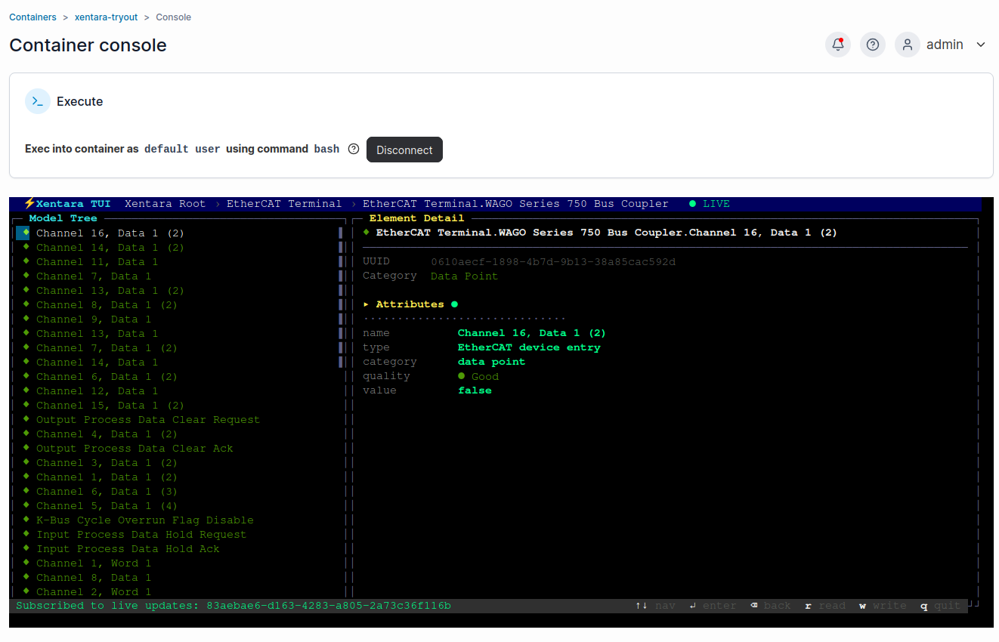

  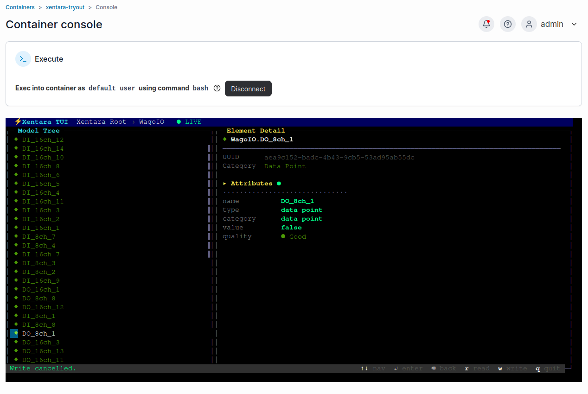

- **Write an output:** select a digital output, press the write key, type
  `true`, Enter. It reaches the coupler on the next bus cycle and the
  physical output switches. Type `false` to release it.

  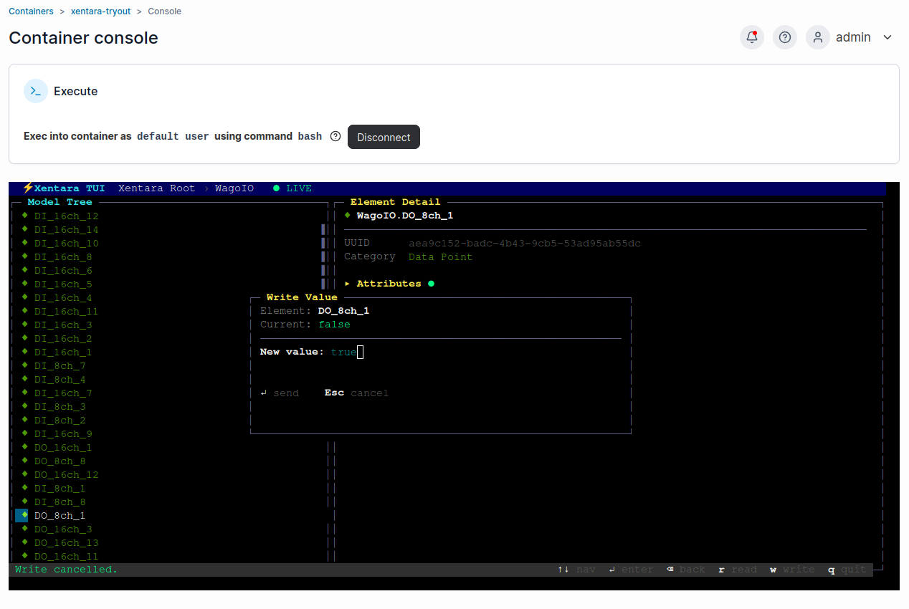

- **Analog values work the same way** - select an analog data point (e.g.
  `WagoIO.AO_2`) and write a raw count instead of `true`/`false`.

  | Browse | Write |
  |---|---|
  | 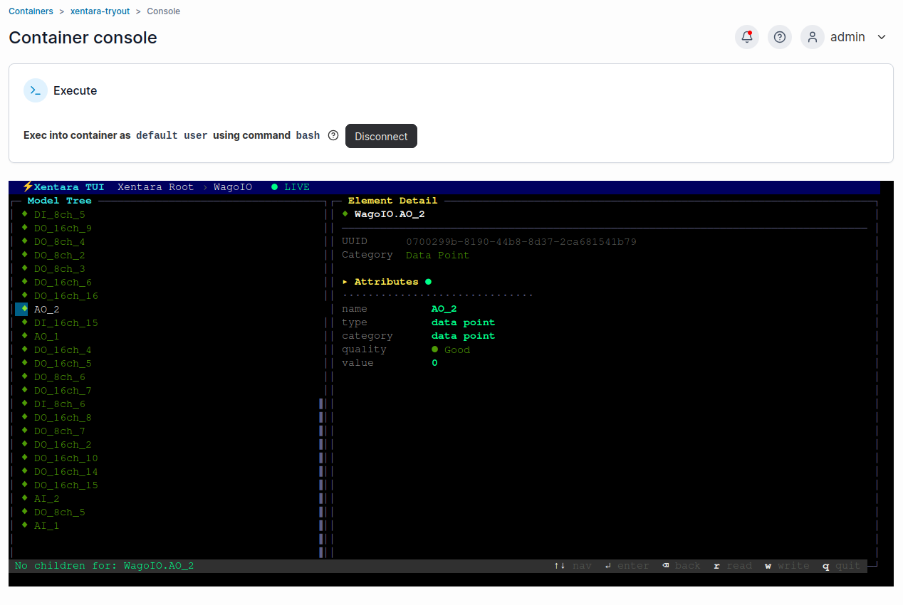 | 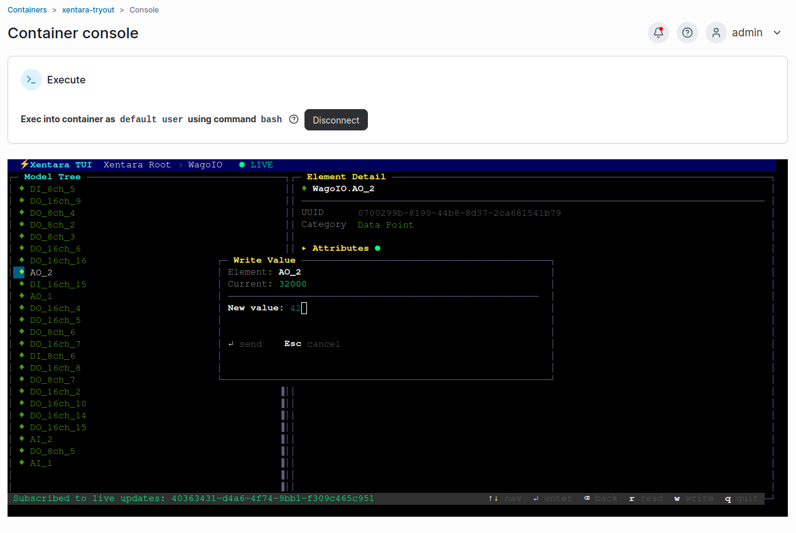 |

- **Cycle time:** open the `RTT` group for live `RttAvgMs` / `RttMinMs` /
  `RttMaxMs`.

  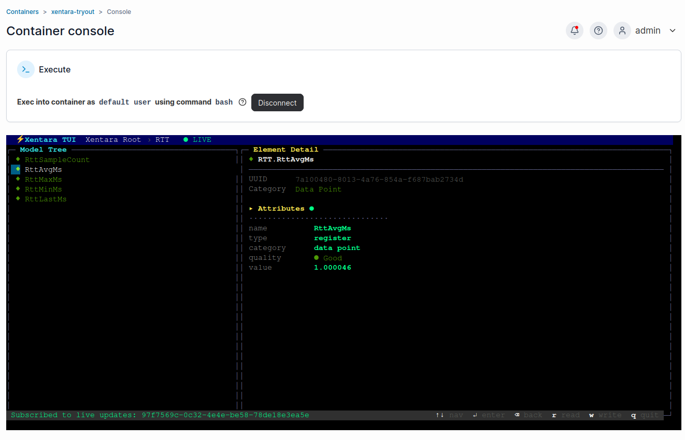

  `RttSampleCount` climbs every cycle - proof the pipeline is actually
  running, not just idling on a loaded-but-stalled model.

  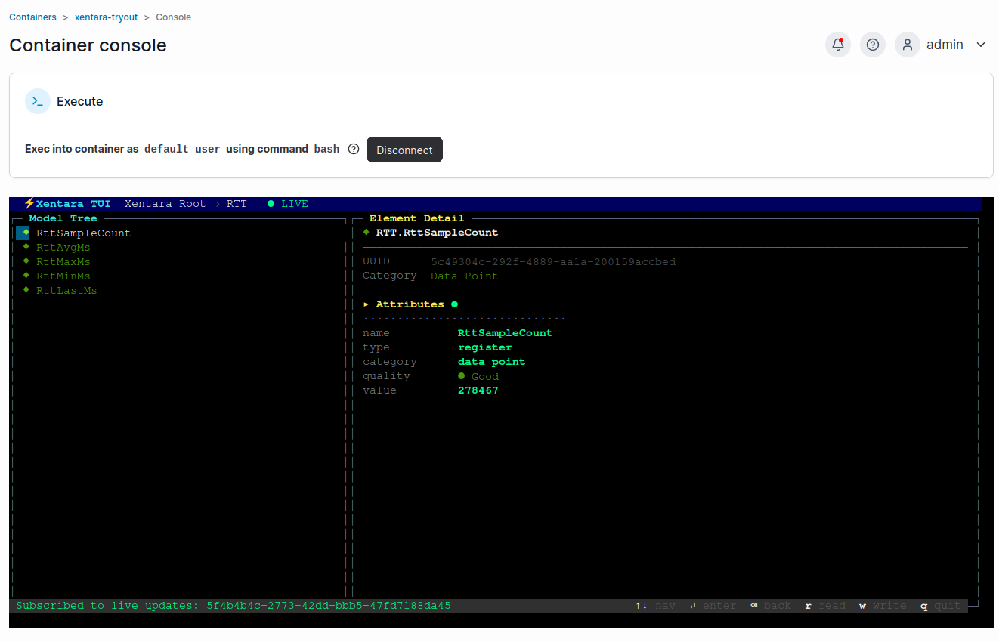

> [!WARNING]
> Physical outputs switch real hardware. Know what's wired before toggling.

## The TUI isn't magic - it's a Web Service client

Editing a value is a single RPC over Xentara's WebSocket
(`wss://<host>:<port>/api/ws`, port 8080 by default - CBOR-encoded, HTTP
Basic auth): **write the value attribute (id `11`) with opcode `5`**. Any HMI
or script can drive I/O the same way; `xentara-tui` itself is a
self-contained reference client. Full protocol: the
[Xentara WebSocket API Specification](https://docs.xentara.io/xentara-websocket-api/).
A minimal Python client to test this is in
[`scripts/rtt_websocket_test.py`](../scripts/rtt_websocket_test.py).

`RTT.RttLastMs`/`MinMs`/`MaxMs`/`AvgMs` measure the `step()`-to-`step()`
interval, i.e. how close the achieved cycle is to the configured Timer
period (browsable in the TUI as `Track EtherCAT Control.1ms Timer`, below).
That is a software/scheduling number, not a hardware one: it says nothing
about how long a physical output actually takes to reach a physical input.
For that, see [App 3](app-rtt-kbus.md).

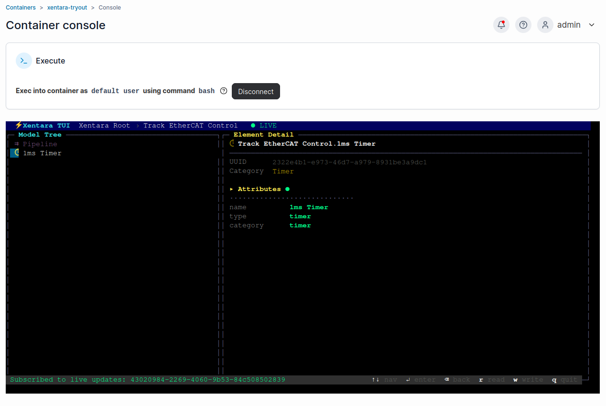

That's the whole app. Writing your own control? See
[Blueprint](blueprint.md). Adding a verified hardware round trip? See
[App 3](app-rtt-kbus.md). AI-driven outputs over MQTT? See
[App 4](app-mqtt-payload-control.md).
