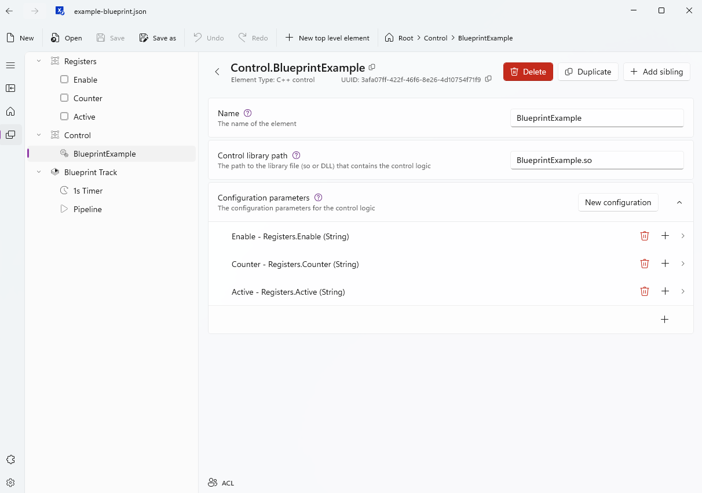

# Blueprint - build your own C++ and EtherCAT control

← [Back to README](../README.md) · Do [App 2](app-rtt.md) first, then read this.

You've now deployed and run a real control module (`EtherCATRttProbe`) and
seen how it's wired into the model. This section generalizes that into a
recipe for writing your **own** control from scratch - [App 3](app-rtt-kbus.md)
is a second, more advanced worked example of the same recipe, so read this
first if you're about to write custom logic rather than just wire loopbacks.

## Run the smallest working example first

[`control/blueprint-example/`](../control/blueprint-example/) is the reference
implementation of everything below: one input, two outputs, no hardware, no
discovery step. Build and deploy it the same way as
[Step B](app-rtt.md#step-b---build-and-deploy-the-rtt-probe), then load
[`model/example-blueprint.json`](../model/example-blueprint.json) directly (it's
a complete model, not a template) and open it in the TUI or connect Xentara
Workbench to browse it - the `Registers` and `Control` groups below map
one-to-one onto the code walked through in this section.



> [!NOTE]
> **Validated:** built cleanly against the Xentara build image, loaded with
> no errors, and confirmed stepping once a second - writing
> `Registers.Enable = true` was followed by `Registers.Counter` incrementing
> by exactly one per elapsed second and `Registers.Active` mirroring `Enable`,
> checked directly with `xentara-debugger`.

Two references to copy from once you're past the minimal example, depending
on what your control needs to do:

| Copy this if your control... | Reference |
|---|---|
| Only computes/publishes values, touches no physical I/O | [`control/ethercat-rtt-probe/`](../control/ethercat-rtt-probe/) |
| Reads and/or writes physical I/O channels | [`control/ethercat-kbus-rtt-probe/`](../control/ethercat-kbus-rtt-probe/) |

## 1. Anatomy of a control

Every Xentara C++ control is one class deriving from `xentara::Control`,
with two methods and one registration line:

```cpp
// YourControl.hpp
#include <xentara/cpp-control.h>

class YourControl final : public xentara::Control
{
public:
    void initialize(xentara::InitContext &context) override;
    void step(xentara::RunContext &context) override;
};
```

```cpp
// YourControl.cpp
#include "YourControl.hpp"

// Registers the class with Xentara - required exactly once per module.
const xentara::ControlExporter<YourControl> kYourControl;

void YourControl::initialize(xentara::InitContext &context) { /* bind data points, see step 3 */ }
void YourControl::step(xentara::RunContext &context) { /* runs once per scheduled cycle */ }
```

`initialize()` runs once at load; `step()` runs on every cycle the model's
pipeline schedules it for (see step 4). Xentara enrolls **exactly one** C++
control per running instance - see the
[`multiple controls are enrolled`](troubleshooting.md#building-your-own-control-module-app-2--app-3--app-4)
troubleshooting entry if you hit that.

## 2. Project skeleton

Same `CMakeLists.txt` shape for every control - copy
[`control/ethercat-rtt-probe/CMakeLists.txt`](../control/ethercat-rtt-probe/CMakeLists.txt)
and rename:

```cmake
cmake_minimum_required(VERSION 3.25)
project(YourControl LANGUAGES CXX)

find_package(XentaraCPPControl REQUIRED)

add_library(YourControl MODULE "src/YourControl.cpp")

target_link_libraries(YourControl PRIVATE Xentara::cpp-control)
```

Build the same way as [Step B](app-rtt.md#step-b---build-and-deploy-the-rtt-probe) -
inside the `xentara/xentara-build` image, once for `amd64`, once for
`arm64` if you're targeting a PFC300. See
[`control/ethercat-rtt-probe/README.md`](../control/ethercat-rtt-probe/README.md)
for the exact build command; it's identical for any control, only the
project name changes.

## 3. Declare and bind your data points

Data points flow in through `initialize()`, by name, via
`context.config().getDataPoint("Name")` - one line per value your control
reads or writes:

```cpp
void YourControl::initialize(xentara::InitContext &context)
{
    someOutput = context.config().getDataPoint("SomeOutput");
    someInput  = context.config().getDataPoint("SomeInput");
}
```

Each name is resolved through the model's `@Skill.CPP.Control` node, whose
`parameters` map the names your C++ code uses to the actual data points in
the model tree:

```jsonc
{
  "@Skill.CPP.Control": {
    "name": "YourControl",
    "controlPath": "YourControl.so",
    "parameters": {
      "SomeOutput": "Registers.SomeOutput",
      "SomeInput": "Connection.SomeInput"
    }
  }
}
```

- `controlPath` is always the **bare filename** - no `control/` prefix (see
  the [troubleshooting entry](troubleshooting.md#building-your-own-control-module-app-2--app-3--app-4)
  if `step()` silently never runs).
- The target on the right (`Registers.SomeOutput`, `Connection.SomeInput`)
  must already exist elsewhere in the model - typically a
  `@Skill.SignalFlow.Register` you declare yourself for computed values (as
  App 2 does for its five `RTT.*` registers), or a discovered EtherCAT
  channel aliased into a `@Group` (as App 3 does for `Connection.Do/Di/Ao/Ai`).
  Model editing beyond hand-adding a register or two is Workbench territory
  - see the [warning](../README.md#choose-your-app) on never hand-writing bus addresses.

## 4. Schedule it

A control does nothing until its `step` function is wired into a
`@Pipeline` task, driven by a `@Timer` inside a `@Track` - the same pattern
`template-rtt.json` already uses:

```jsonc
{ "@Timer": { "name": "1ms Timer", "period": "1ms" } },
{
  "@Pipeline": {
    "triggers": [ "EtherCAT Track.1ms Timer.expired" ],
    "segments": [
      { "start": 0, "end": 1, "tasks": [
        { "function": "Control.YourControl.step" },
        { "function": "EtherCAT Terminal.loop" }
      ]}
    ]
  }
}
```

Order inside a segment matters: put your control's `step` **before** the
EtherCAT bus loop task if it needs to set outputs that should go out that
same cycle (as both example probes do), or **after** it if it needs to react
to inputs the bus loop just read.

## 5. Deploy and iterate

Same two-command loop as [Step B](app-rtt.md#step-b---build-and-deploy-the-rtt-probe)
and [Step D](app-rtt.md#step-d---load-the-model): `docker cp` the freshly built `.so`
into `control/`, `docker cp` the updated `model.json` in if you changed
wiring, restart, check **Logs**. No rediscovery needed unless the physical
terminal row itself changed.
