# Deployment workflow (detailed reference)

← [Back to README](../README.md)

Every step from both tracks, with the existing-app fast path that skips
straight to deploy. Node labels match the step headers in the app guides one
for one - follow the legend to jump to the exact instructions for any node.

```mermaid
%%{init: {'theme':'base', 'themeVariables': {
  'primaryColor':'#1F2837',
  'primaryTextColor':'#ffffff',
  'primaryBorderColor':'#6EC800',
  'lineColor':'#6EC800',
  'secondaryColor':'#EFF0F1',
  'secondaryTextColor':'#1F2837',
  'secondaryBorderColor':'#A5A8AF',
  'tertiaryColor':'#FFFFFF',
  'tertiaryTextColor':'#1F2837',
  'tertiaryBorderColor':'#DEDFE1',
  'fontFamily':'Segoe UI, Helvetica, Arial, sans-serif',
  'clusterBkg':'#EFF0F1',
  'clusterBorder':'#A5A8AF',
  'edgeLabelBackground':'#1F2837'
}}}%%
flowchart TB
    subgraph Setup["Shared setup - every app starts here"]
        direction TB
        S0("Step 0: clone the repo<br/>git clone https://github.com/WagoAlex/wago-xentara-example.git<br/>cd wago-xentara-example")
        S1("Step 1: deploy the stack<br/>Portainer → Stacks → Add stack → Web editor<br/>paste docker-compose.yml → Deploy the stack")
        S2("Step 2: license it<br/>Console: xentara-licence-id<br/>activate node ID at customerportal.xentara.io<br/>Restart → Logs: 'Model uses N of … data points'")
        S0 --> S1 --> S2
    end

    S2 --> Track{"Hardware<br/>available?"}

    Track -- "No" --> App1

    subgraph App1["App 1 - Xentara example, no hardware"]
        direction TB
        A1("Load the model<br/>docker cp schemas/sample-model.json<br/>xentara-tryout:/home/xentara/.config/xentara/model.json<br/>Restart → Logs: 'Using model file …'")
        A2("Watch it run<br/>xentara-tui --host localhost --port 8080 --user xentara<br/>browse Signals: Pulse, Sine Wave, Triangle, Noise, …")
        A1 --> A2
    end

    Track -- "Yes" --> Reuse{"Already have a built<br/>.so and a model.json?"}

    Reuse -- "No - first time" --> App2Build
    Reuse -- "Yes - reuse them" --> FastPath

    subgraph App2Build["App 2 - WAGO RTT: control/ethercat-rtt-probe/"]
        direction TB
        BA("Step A: network the NIC<br/>device WBM → Networking/TCP-IP<br/>EtherCAT port: no IPv4, note interface name (e.g. X11)")
        BB("Step B: build + copy the probe<br/>build → libEtherCATRttProbe.so<br/>docker cp build-amd64/libEtherCATRttProbe.so<br/>xentara-tryout:/home/xentara/.config/xentara/control/EtherCATRttProbe.so")
        BC("Step C: discover I/O<br/>docker stop xentara-tryout<br/>xentara-ethercat-model-file-generator<br/>-i template-rtt.json -o model.json -b your-nic -m online<br/>docker start xentara-tryout")
        BD("Step D: load the model<br/>docker cp model.json<br/>xentara-tryout:/home/xentara/.config/xentara/model.json<br/>Restart → Logs: 'Using model file …'")
        BE("Step E: open the TUI<br/>xentara-tui --host localhost --port 8080 --user xentara<br/>browse WagoIO, write true/false, watch RTT.RttAvgMs")
        BA --> BB --> BC --> BD --> BE
    end

    subgraph FastPath["Existing-app fast path"]
        direction TB
        FA("Reuse the .so + model.json<br/>e.g. model/example-rtt.json<br/>docker cp both files in as above → Restart<br/>skip Steps A - D entirely")
    end

    App2Build --> App2Done{"Add hardware round trip,<br/>or AI-driven outputs?"}
    FastPath --> App2Done

    App2Done -- "No" --> Done("Done - App 2 running")
    App2Done -- "Verified round trip,<br/>wire loopback" --> App3Prep
    App2Done -- "AI-driven outputs,<br/>via MQTT" --> App4Prep

    App3Prep("Redo Steps A - E with<br/>model/template-rtt-kbus.json and<br/>control/ethercat-kbus-rtt-probe/")

    subgraph App3["App 3 - WAGO RTT + K-Bus"]
        direction TB
        CF("Step F: wire the loopback<br/>e.g. DO_8ch_8 → DI_8ch_1<br/>e.g. AO_1 → AI_1")
        CG("Step G: bind wired channels<br/>set Connection.Do / Di / Ao / Ai<br/>io fields to the two channels wired above")
        CH("Step H: watch the round trip<br/>browse RTT.KbusCycleAvgMs,<br/>RTT.AnalogStep*, RTT.AnalogGradual*")
        CF --> CG --> CH
    end

    App3Prep --> CF

    App4Prep("Run an MQTT broker +<br/>wago-hailo-example,<br/>publishing to inference/yolov5m-results<br/>Stop Docker or native, whichever owns the NIC")

    subgraph App4["App 4 - MQTT Payload Control (native install only)"]
        direction TB
        DI("Step I: confirm the feed<br/>mosquitto_sub -t inference/yolov5m-results -v<br/>detections array arriving")
        DJ("Step J: build the control<br/>build → libMQTTPayloadControl.so<br/>scp to ~/.config/xentara/control/MQTTPayloadControl.so")
        DK("Step K: discover I/O<br/>xentara-ethercat-model-file-generator<br/>-i template-mqtt-payload-control.json -o model.json")
        DL("Step L: load the model<br/>edit brokerAddress, scp model.json<br/>→ ~/.config/xentara/model.json<br/>systemctl restart xentara@user.service")
        DM("Step M: watch it react<br/>xentara-debugger, read Registers.MQTT-Payload<br/>and Connection.DO1-White / DO2-Blue / DO3-Head")
        DI --> DJ --> DK --> DL --> DM
    end

    App4Prep --> DI
```

| Node | Jump to |
|---|---|
| Step 0 | [Clone this repo](../README.md#step-0---clone-this-repo) |
| Step 1 | [Download + deploy the runtime](../README.md#step-1---download--deploy-the-runtime-browser) |
| Step 2 | [License it](../README.md#step-2---license-it-browser) |
| App 1 - Load the model | [App 1: Load the model](app-demo.md#load-the-model) |
| App 1 - Watch it run | [App 1: Watch it run](app-demo.md#watch-it-run) |
| Step A | [Network the EtherCAT NIC](app-rtt.md#step-a---network-the-ethercat-nic-browser) |
| Step B | [Build and deploy the RTT probe](app-rtt.md#step-b---build-and-deploy-the-rtt-probe) |
| Step C | [Discover your I/O modules](app-rtt.md#step-c---discover-your-io-modules) |
| Step D | [Load the model](app-rtt.md#step-d---load-the-model) |
| Step E | [Open the TUI and write an output](app-rtt.md#step-e---open-the-tui-and-write-an-output-browser) |
| Step F | [Wire the loopback](app-rtt-kbus.md#step-f---wire-the-loopback) |
| Step G | [Bind the wired channels](app-rtt-kbus.md#step-g---bind-the-wired-channels) |
| Step H | [Watch the round trip in the TUI](app-rtt-kbus.md#step-h---watch-the-round-trip-in-the-tui) |
| Step I | [Run the inference source](app-mqtt-payload-control.md#step-i---run-the-inference-source-external) |
| Step J | [Build the control](app-mqtt-payload-control.md#step-j---build-the-control) |
| Step K | [Discover your I/O modules](app-mqtt-payload-control.md#step-k---discover-your-io-modules) |
| Step L | [Load the model](app-mqtt-payload-control.md#step-l---load-the-model) |
| Step M | [Watch it react](app-mqtt-payload-control.md#step-m---watch-it-react) |

- **Steps 0-2** are one-time per device; App 1 needs nothing past Step 2.
- **Steps A-D** only need re-running when the physical terminal row changes
  (rediscover) or the control logic changes (rebuild). The full generator
  command (`-n "EtherCAT Terminal" -v`, etc.) is in
  [Step C](app-rtt.md#step-c---discover-your-io-modules).
- **Existing-app fast path**: redeploying a control you already built and a
  `model.json` you already have (e.g.
  [`model/example-rtt.json`](../model/example-rtt.json)) skips Steps A-D
  entirely - copy the `.so` and the model in, restart, done.
- **App 3** reuses Steps A-E of App 2 verbatim, just swapping in
  [`model/template-rtt-kbus.json`](../model/template-rtt-kbus.json) and
  [`control/ethercat-kbus-rtt-probe/`](../control/ethercat-kbus-rtt-probe/)
  for the RTT-only template and probe, before Steps F-H.
- **App 4** shares the same coupler as App 2 but runs on the **native**
  Xentara install, not `xentara-tryout` - its own
  [`model/template-mqtt-payload-control.json`](../model/template-mqtt-payload-control.json)
  and
  [`control/mqtt-payload-control/`](../control/mqtt-payload-control/), plus
  an external MQTT/AI feed instead of loopback wiring. See the
  [App 4 warning](app-mqtt-payload-control.md#app-4---mqtt-payload-control-ai-driven-outputs) for why.
